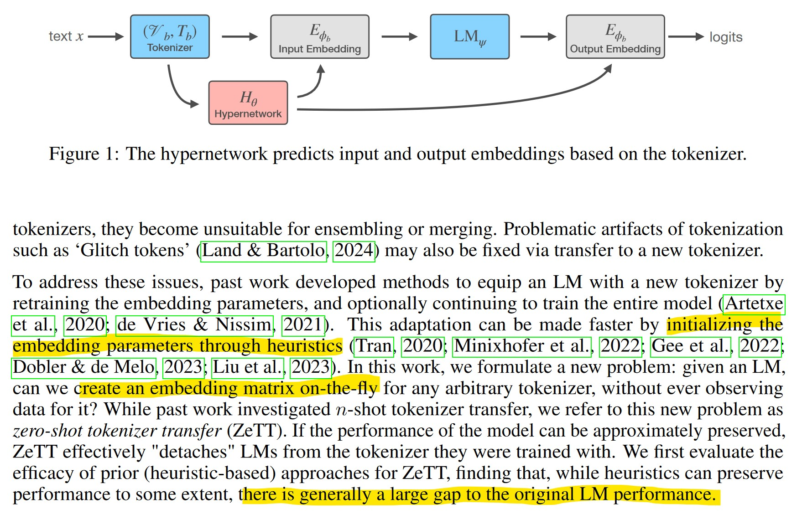
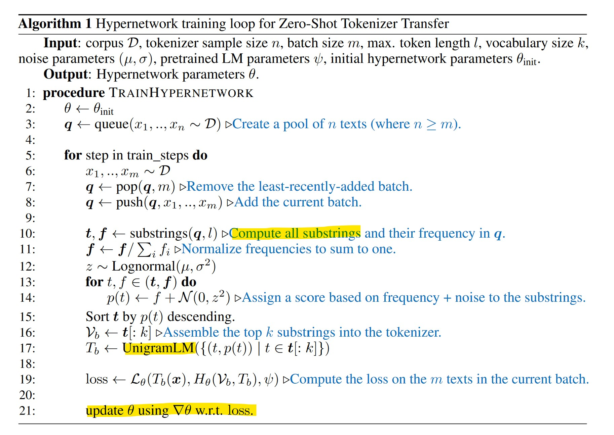
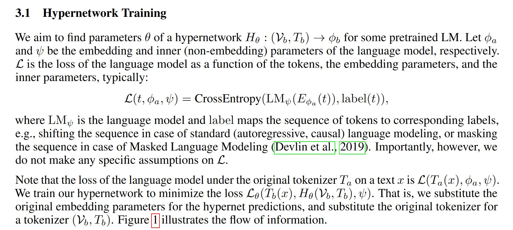
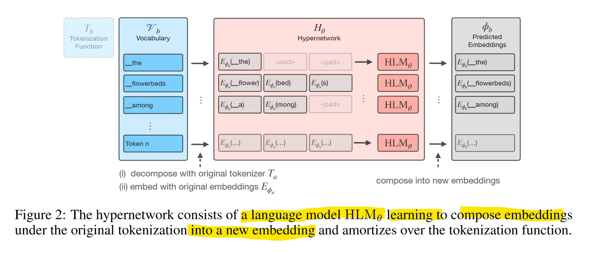
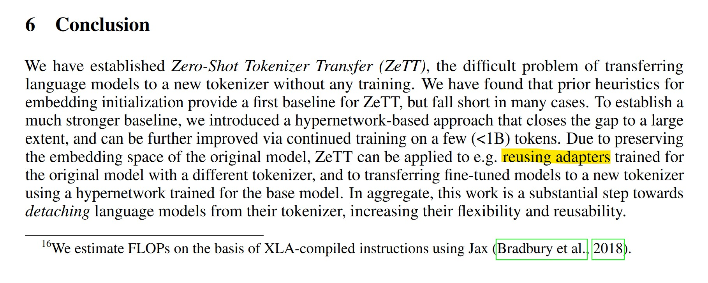

## zero-shot tokenizer transfer (ZeTT)

- https://arxiv.org/pdf/2405.07883
- https://github.com/bminixhofer/zett

cái này giống adapter để cắm 1 bộ tknz bất kỳ vào 1 model bất kỳ. nhìn rộng ra adapter sẽ giúp embedding values của token có khả năng thay đổi theo ngữ cảnh (adapt) ... sẽ làm đc nhiều trò ... mình sẽ có token => embedding value mapping mềm chứ ko 1-1 nữa.

We train a hypernetwork on a diverse distribution of tokenizers to predict the embedding parameters for any given tokenizer.

ZeTT via the hypernetwork preserves performance to a few percent accuracy in many cases.

**the hypernetwork can learn to rapidly adapt to a given target tokenizer by continued training on a small amount (<1B) of extra tokens** => Tương đương 5GB of text.

## Embedding Initialization Heuristics
Prior work transfers LMs to a new tokenizer by initializing
embedding parameters via a heuristic, then continuing to train the embeddings.

- init new embeddings value = mean old decoded embeddings 
  (the mean of the sequence of embeddings the new token is decomposed into by the previous tokenizer)

- RAMEN, WECHSEL, OFA require auxiliary embeddings `Eaux : Vaux → Rdaux` ...

- FOCUS initializes embeddings of tokens in Vb \ Va as a weighted combination of the overlapping
tokens `Va ∩ Vb`, and **copies the embeddings of the overlapping tokens**. Weights are again computed
using an auxiliary embedding matrix `Eaux`, but the only requirement is `|Vaux ∩ Vb| !≪ |Vb|`.	

We use FOCUS as the main baseline show it obtains better performance
without any training (i.e., zero-shot) than other heuristics

## Heuristic-Free Tokenizer Transfer
While a significant amount of prior work has investigated
heuristics to initialize the embedding layer, there is also research into changing the training procedure
to facilitate `n-shot tokenizer transfer`. Marchisio et al. (2023) show that forward- and backward-
propagating through a `subset of the model layers` is sufficient for learning embeddings for a new
tokenizer. Chen et al. (2023) find that `regularly resetting the embedding parameters during pretraining`
boosts the speed at which they are relearnt upon transfer.

These approaches can be seen as `orthogonal to ours. They could be freely combined with our method`; we leave this to future work.

## Embedding Prediction Hypernetworks
Hypernetworks are networks that predict the parameters of another network.
Prior work uses neural networks to predict embeddings for out-of-vocabulary or rare words.
These methods can also be viewed as embedding prediction hypernetworks. 

In contrast, the hypernetwork we propose (i) approaches the more general
problem of transferring to an arbitrary tokenizer, instead of extending the original tokenizer and (ii)
can be applied to encoder, decoder, and encoder-decoder LMs, that is, it is objective-agnostic.

**Defining Distributions over Texts and Tokenizers**. We follow standard practice and sample texts
uniformly from the training corpus.

Tokenizer sampling is not as trivial: we would like a distribution over tokenizers (Vb, Tb) 
with high variance to encourage generalization to unseen tokenizers. To this
end, we introduce a procedure to sample a diverse set of UnigramLM tokenizers. We show later in
Section 5 that arbitrary tokenizers can be well-approximated via UnigramLM, motivating this choice.

Importantly, the texts and the tokenizer are sampled dependently: the batch of m texts used for
training is a subset of the n texts used for sampling the tokenizer. If they were sampled independently,
the probability for a token to occur would be `p(token) ∝ p(token ∈ Vb) × p(token ∈ x)`. Since both
these factors are small for rare tokens, `p(token)` would get vanishingly small in this case.

## Hypernetwork Architecture
The hypernetwork thus consists of another language model which is applied separately for every token. 
We refer to the hypernetwork’s language model as HLMθ . HLMθ can be thought of as learning how to compose
the sequence of tokens Ta(t)—which any given token is decomposed into—into one embedding,
as illustrated in Figure 2.

https://huggingface.co/benjamin/zett-hypernetwork-multilingual-Mistral-7B-v0.1/tree/main

Adapter bự quá, lên tới gần 1.5b