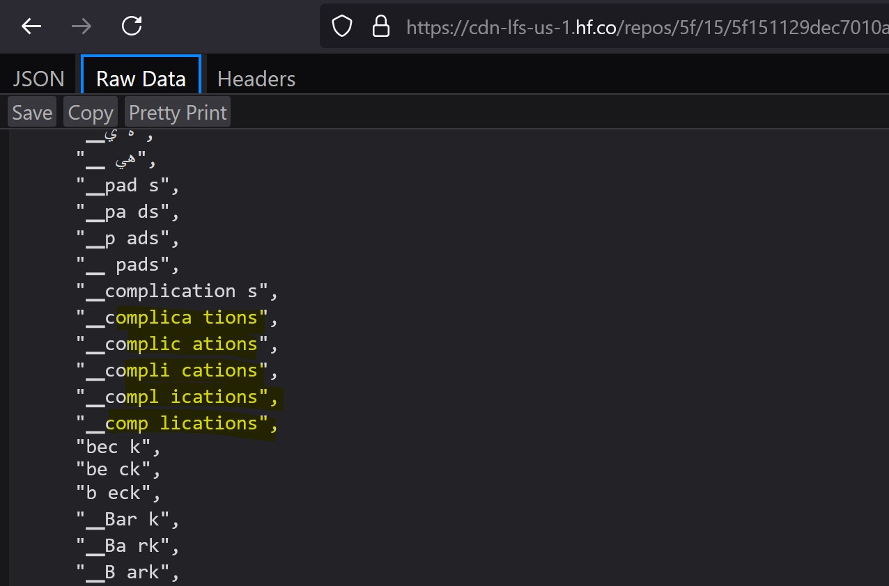
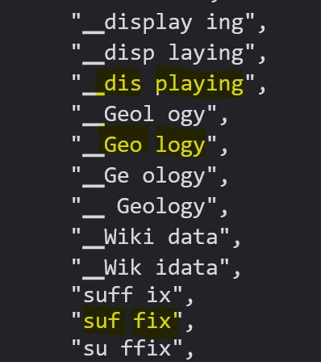
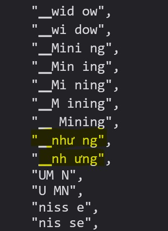

gemma vocab
https://huggingface.co/google/gemma-2-27b/blob/main/tokenizer.json

Tại sao lại bỏ space vào giữa từ tiếng Anh ???

có lẽ là để làm rõ tiền tố, hậu tốt và root

Tiếng Việt cũng bị cắt
