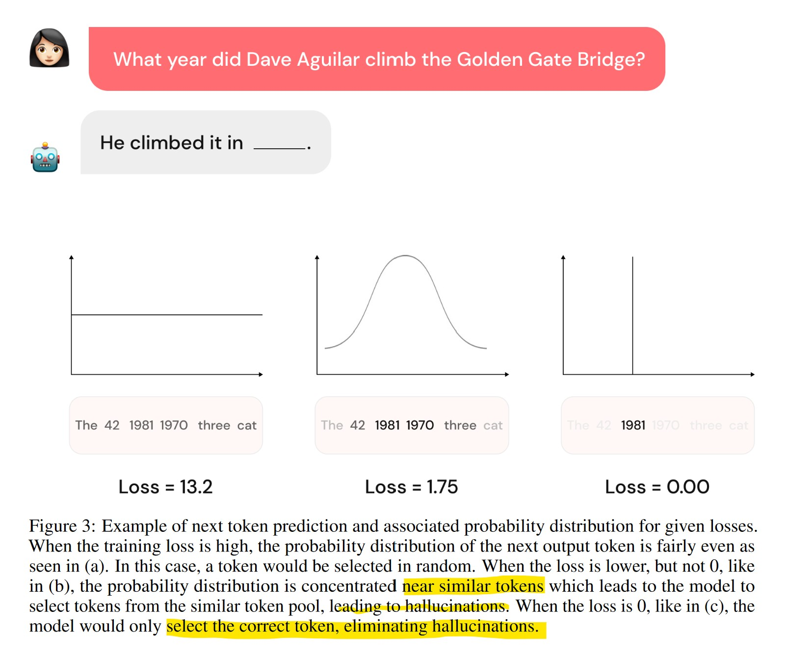
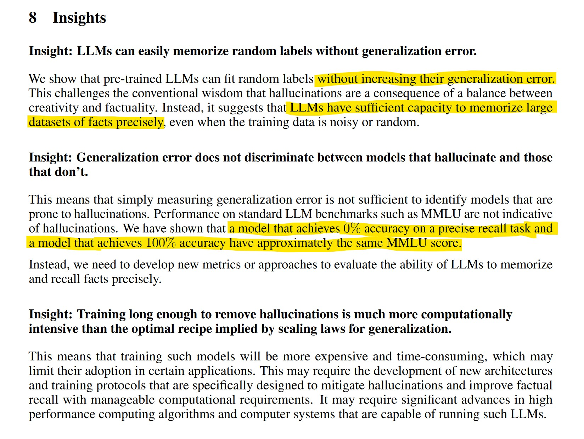
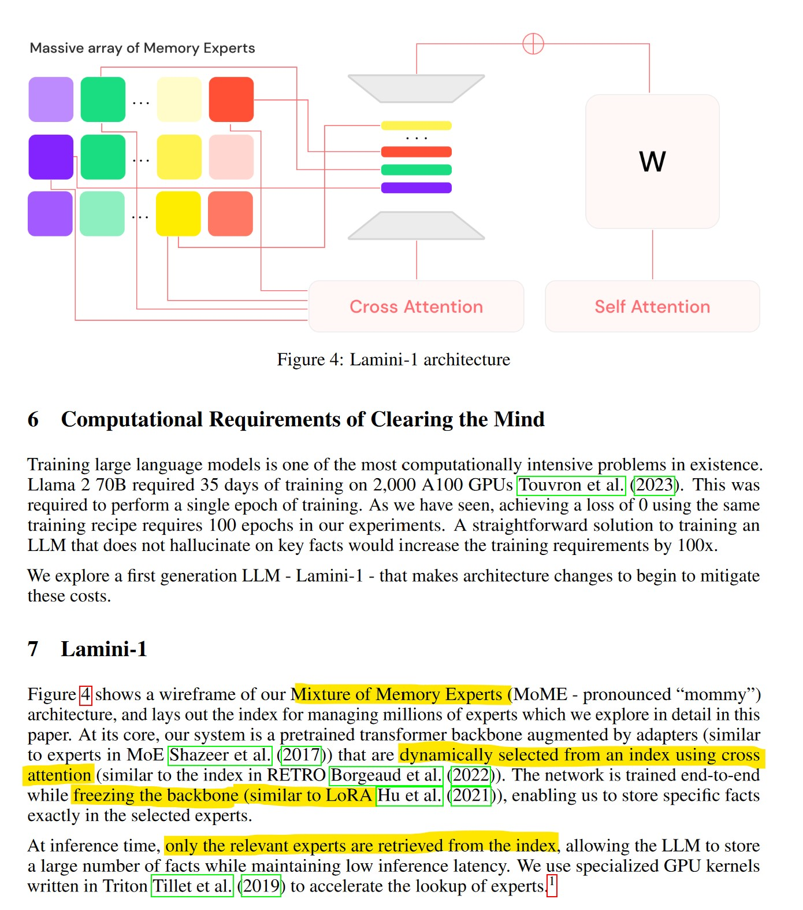
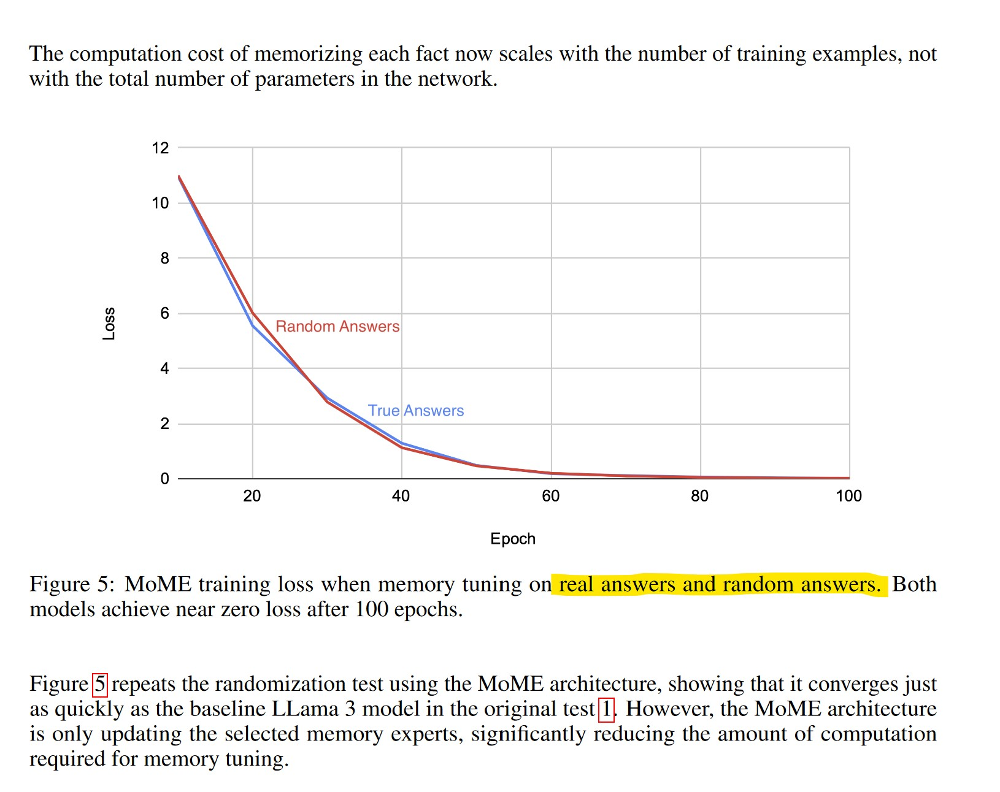
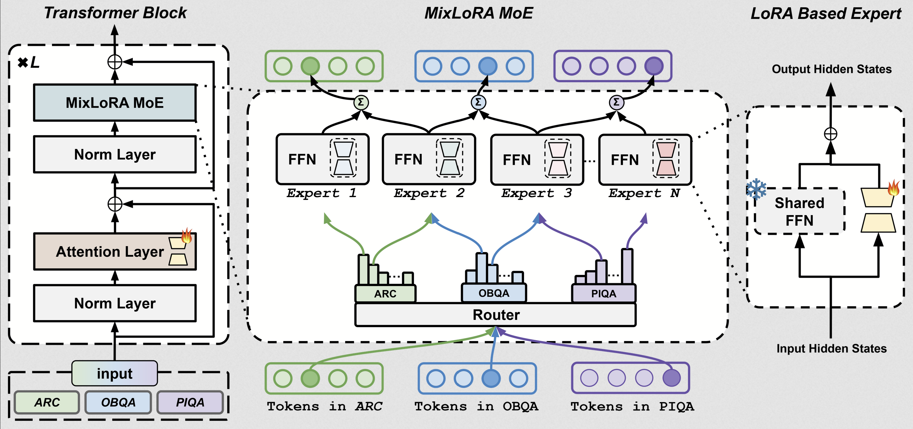
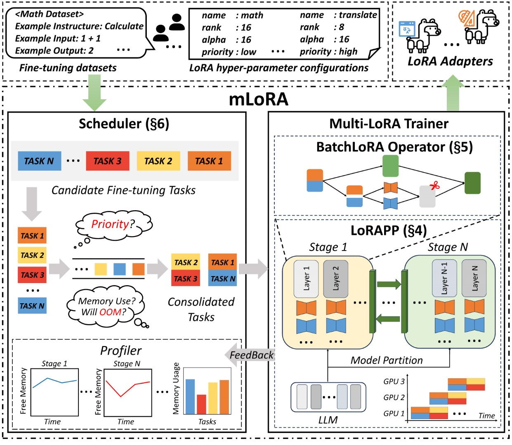

- https://arxiv.org/abs/2406.17642

LLMs augmented with a massive Mixture of Memory Experts (MoME) can easily memorize large datasets

simple neural networks trained to predict the next token hallucinate when the training loss 
is above a threshold as it usually does in practice when training on internet scale data

design a model for removing hallucinations that stores facts in a massive mixture of 
millions of memory experts that are retrieved dynamically





## Insights

- LLM có thể dễ dàng nhớ được random labels mà **không làm tăng tỉ lệ lỗi tổng quan hóa**
  Nó có đủ năng lực để nhớ facts một cách chính xác kể cả dữ liệu huấn luyện bị nhiễu hoặc random.

- Điểm tổng quan hóa không phản ánh LLMs có hallu hay không.
  Một LLM rất hallu với 1 LLM không hallu có thể có điểm số MMLU là như nhau.

- Sẽ tốn computing để remove hallu



The massive MoME is designed to cut down on the amount of computation required to memorize
facts. This is accomplished by the following training algorithm:

1. `For a given question`, select a subset of experts, e.g. `32 out of the array of one million`.

2. Freeze the weights of the backbone network and the cross attention used to select the expert.

3. Take gradient descent steps until the loss is reduced sufficiently to memorize the fact.

One problem is that the `same expert may be selected multiple times` for different facts during training. This can be mitigated by first `training the cross attention selection mechanism during generalization training, e.g. for one epoch`, followed by freezing its weights. This results in the same expert being selected for each fact on each training step.

- - -

Một vấn đề là `cùng một chuyên gia có thể được chọn nhiều lần` cho các sự kiện khác nhau trong quá trình huấn luyện. Điều này có thể được giảm thiểu bằng cách `huấn luyện cơ chế chọn lựa cross attention trong quá trình huấn luyện tổng quát, ví dụ trong một epoch`, sau đó cố định các trọng số của nó. Kết quả là cùng một chuyên gia sẽ được chọn cho mỗi sự kiện trong từng bước huấn luyện. (chưa hiểu lắm)



- - -

=> DÙNG NHIỀU LORAS ĐỂ GHI NHỚ FACTS. CẦN MAP QUERY TỚI LORA(S) PHÙ HỢP ĐỂ "MEMORIZE" AND "RETRIEVE".

=> Tìm hiểu LoRA MoE

- https://github.com/TUDB-Labs/MixLoRA

- https://github.com/predibase/lorax (Apache 2.0 License)
  serve thousands of fine-tuned models on a single GPU.


- - -

https://github.com/jondurbin/airoboros#lmoe

LMoE is the simplest architecture I can think of for a mixture of experts. It just `dynamically loads the best PEFT/LoRA adapter` **based on the incoming request**. => Routing to one expert at a time!

By using this method, we can theoretically crowdsource generation of dozens (or hundreds/thousands?) of very task-specific adapters and have an extremely powerful ensemble of models with very limited resources on top of a single base model (llama-2 7b/13b/70b).

- - -


https://github.com/TUDB-Labs/MixLoRA

Các mô hình Mixture-of-Expert (MoE), chẳng hạn như Mixtral 8x7B, cho thấy hiệu suất đáng kể trong các tình huống học đa nhiệm trong khi vẫn duy trì số lượng tham số giảm. Tuy nhiên, yêu cầu tài nguyên của các MoE này vẫn là một thách thức, đặc biệt đối với các `GPU dưới 24GB`. Để giải quyết những thách thức này, chúng tôi đề xuất MixLoRA, một phương pháp để xây dựng một mô hình MoE thưa tài nguyên dựa trên LoRA.



Hình trên cho thấy kiến trúc của khối transformer MixLoRA. MixLoRA chèn nhiều chuyên gia dựa trên LoRA vào bên trong khối mạng feed-forward của một mô hình dày đặc đã được đông cứng và sử dụng bộ định tuyến `top-k` phổ biến. Không giống như các phương pháp MoE dựa trên LoRA khác, MixLoRA tăng cường hiệu suất mô hình bằng cách sử dụng các bộ điều hợp LoRA lớp chú ý độc lập. Ngoài ra, một `hàm mất mát cân bằng tải` phụ trợ được sử dụng để giải quyết vấn đề mất cân bằng của bộ định tuyến. Các đánh giá của chúng tôi cho thấy `MixLoRA cải thiện khoảng 9% độ chính xác` so với các phương pháp PEFT tiên tiến trong các tình huống học đa nhiệm.

- - -

https://github.com/TUDB-Labs/mLoRA

Using mLoRA can save significant computational and memory resources when training multiple adapters simultaneously.

- Concurrent fine-tuning of multiple LoRA adapters.

- Efficient pipeline parallelism algorithm.

- Support for multiple LoRA variant algorithms and various base models.

- Support for multiple reinforcement learning preference alignment algorithms. (DPO, PPO ...)



!!! MỚI HỖ TRỢ LLAMA !!!

- - -

https://github.com/TUDB-Labs/MoE-PEFT

MoE-PEFT is an open-source LLMOps framework built on `mLoRA`. It is designed for high-throughput fine-tuning, evaluation, and inference of Large Language Models (LLMs) using techniques such as MoE + Others (like LoRA, DoRA). Key features of MoE-PEFT include:

- Concurrent fine-tuning, evaluation, and inference of multiple adapters with a shared pre-trained model.

- MoE PEFT optimization, mainly for MixLoRA and other MoLE implementation.

- Support for multiple PEFT algorithms and various pre-trained models.

- Seamless integration with the HuggingFace ecosystem.

Supported PEFT Methods
- ✓ 	MoLA 		"routing_strategy": "mola",    "num_experts": 8
- ✓ 	LoRAMoE 	"routing_strategy": "loramoe", "num_experts": 8
- ✓ 	MixLoRA 	"routing_strategy": "mixlora", "num_experts": 8

- - -

https://docs.google.com/document/u/0/d/1OjbjU5AOz4Ftn9xHQrX3oFQGhQ6RDUuXQipnQ9gn6tU/mobilebasic

First we take the Base model: Qwen/Qwen2-7B
Then we finetune it on an instruct dataset using the same chat format as the target model we are merging with.

Target merge model: Qwen/Qwen2-7B-Instruct

Now is the fun part. We actually Take the Lora, and don't apply it to the Base model we just fine-tuned. We apply the Lora onto our Target model which in this case would be (Qwen/Qwen2-7B-Instruct). But we do not train on top of this model. It is very important that you do this exactly this way. Train on the Base, Apply lora on the Target.


Now we have our new model that is the lora merged with the Target model. Lets call it our `Lora_model_7b`. Now the real magic happens. **We use mergekit to update all the weights**. https://github.com/arcee-ai/mergekit

We want to use all 3 versions of the model, the Base, Target, and Lora model in mergkit using the Ties Method.


I actually learned its better to do the merge all in 1 time, even if you continue to finetune more times. Like this
```
models:
 - model: Qwen2.5-7B-Instruct-Adapted-Finetune-1
   parameters:
     weight: 1
     density: 1

 - model: Qwen2.5-7B-Instruct-Adapted-Finetune-2
   parameters:
     weight: 1
     density: 1

 - model: Qwen2.5-7B-Instruct-Adapted-Finetune-3
   parameters:
     weight: 1
     density: 1

 - model: Qwen2.5-7B-Instruct-Adapted-Finetune-4
   parameters:
     weight: 1
     density: 1

 - model: Qwen2.5-7B-Instruct
   parameters:
     weight: 1
     density: 1

merge_method: ties

base_model: Qwen2.5-7B-Base

parameters:
 normalize: true
 int8_mask: true

tokenizer_source: Qwen2.5-7B-Instruct # This can be whichever tokenizer you choose to use

dtype: bfloat16
```

Rather than try to keep doing the method over and over and over. You are better off keeping the adapters in a safe place, and doing it this way. The final resulting model is much better.

Some added clarification. What you are doing here is `merging all the new lora’s/adapters with the target model`, making new model weights for every lora you have, then `merging all the resulting new models back into the target model and the base model with ties`. You are not merging the loras on top of each other. Just in case that was confusing.

