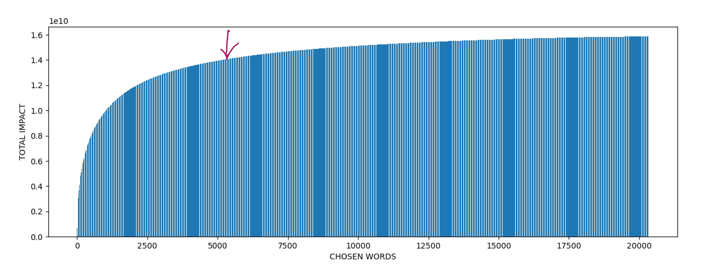

```sh
xzcat data/vi_words_impact_phi.jsonl.xz | head -n 10
{"word": " của",  "impact": 210779631, "phi_tokens": ["", "c", "ủ", "a"], "freq": 70259877, "phi_tokens_count": 4}
{"word": " không","impact": 184233568, "phi_tokens": ["", "k", "h", "ô", "ng"], "freq": 46058392, "phi_tokens_count": 5}   
{"word": " được", "impact": 167506376, "phi_tokens": [" ", "đ", "ư", "ợ", "c"], "freq": 41876594, "phi_tokens_count": 5}   
{"word": " và",   "impact": 141098056, "phi_tokens": ["", "v", "à"], "freq": 70549028, "phi_tokens_count": 3}
{"word": " người","impact": 137681892, "phi_tokens": ["", "ng", "ư", "ờ", "i"], "freq": 34420473, "phi_tokens_count": 5}   
{"word": " những","impact": 118044720, "phi_tokens": ["", "n", "h", "ữ", "ng"], "freq": 29511180, "phi_tokens_count": 5}   
{"word": " một",  "impact": 117620307, "phi_tokens": ["", "m", "ộ", "t"], "freq": 39206769, "phi_tokens_count": 4}
{"word": " với",  "impact": 96667125, "phi_tokens": ["", "v", "ớ", "i"], "freq": 32222375, "phi_tokens_count": 4}
{"word": " các",  "impact": 89806220, "phi_tokens": ["", "c", "ác"], "freq": 44903110, "phi_tokens_count": 3}
{"word": " trong","impact": 79648262, "phi_tokens": ["", "tr", "ong"], "freq": 39824131, "phi_tokens_count": 3}

xzcat data/vi_words_impact_phi.jsonl.xz | head -n 3000 |  tail -n 10 
{"word": " mong_đợi",      "impact": 789360, "phi_tokens": ["", "m", "ong", "", "đ", "ợ", "i"], "freq": 131560, "phi_tokens_count": 7}
{"word": " sung_sướng",    "impact": 789018, "phi_tokens": ["", "s", "ung", "s", "ư", "ớ", "ng"], "freq": 131503, "phi_tokens_count": 7}
{"word": " Ban_Chấp_hành", "impact": 788830, "phi_tokens": ["", "Ban", "Ch", "ấ", "p", "h", "àn", "h"], "freq": 112690, "phi_tokens_count": 8}
{"word": " siêu_thị",      "impact": 788190, "phi_tokens": ["", "si", "ê", "u", "th", "ị"], "freq": 157638, "phi_tokens_count": 6}  
{"word": " mầm_non",       "impact": 788132, "phi_tokens": ["", "m", "ầ", "m", "non"], "freq": 197033, "phi_tokens_count": 5}       
{"word": " Bệnh_nhân",     "impact": 787913, "phi_tokens": ["", "B", "ệ", "n", "h", "n", "h", "ân"], "freq": 112559, "phi_tokens_count": 8}
{"word": " minh_bạch",     "impact": 787280, "phi_tokens": ["", "min", "h", "b", "ạ", "ch"], "freq": 157456, "phi_tokens_count": 6} 
{"word": " cống_hiến",     "impact": 786882, "phi_tokens": ["", "c", "ố", "ng", "hi", "ế", "n"], "freq": 131147, "phi_tokens_count": 7}
{"word": " doanh_nhân",    "impact": 786045, "phi_tokens": ["", "do", "anh", "n", "h", "ân"], "freq": 157209, "phi_tokens_count": 6}
{"word": " Bởi_vậy",       "impact": 785824, "phi_tokens": ["", "B", "�", "�", "�", "i", "v", "ậ", "y"], "freq": 98228, "phi_tokens_count": 9}

xzcat data/vi_words_impact_phi.jsonl.xz | head -n 10000 | tail -n 10
{"word": " Hay_là",        "impact": 141732, "phi_tokens": ["", "Hay", "là"], "freq": 70866, "phi_tokens_count": 3}
{"word": " hang_động",     "impact": 141730, "phi_tokens": ["", "hang", "", "đ", "ộ", "ng"], "freq": 28346, "phi_tokens_count": 6}  
{"word": " vũ",   	       "impact": 141682, "phi_tokens": ["", "v", "ũ"], "freq": 70841, "phi_tokens_count": 3}
{"word": " nước_dùng",     "impact": 141680, "phi_tokens": ["", "n", "ư", "ớ", "c", "d", "ù", "ng"], "freq": 20240, "phi_tokens_count": 8}
{"word": " sư_đệ",		   "impact": 141680, "phi_tokens": ["", "s", "ư", "", "đ", "ệ"], "freq": 28336, "phi_tokens_count": 6}      
{"word": " cực_đại",       "impact": 141659, "phi_tokens": ["", "c", "ự", "c", "", "đ", "ạ", "i"], "freq": 20237, "phi_tokens_count": 8}
{"word": " nghỉ_phép",     "impact": 141582, "phi_tokens": ["", "ng", "h", "�", "�", "�", "ph", "ép"], "freq": 20226, "phi_tokens_count": 8}
{"word": " Tổng_diện_tích","impact": 141580, "phi_tokens": ["", "T", "�", "�", "�", "ng", "di", "ệ", "n", "t", "ích"], "freq": 14158, "phi_tokens_count": 11}
{"word": " huấn",          "impact": 141549, "phi_tokens": ["", "hu", "ấ", "n"], "freq": 47183, "phi_tokens_count": 4}
{"word": " Miến_Điện",     "impact": 141512, "phi_tokens": ["", "Mi", "ế", "n", "", "Đ", "i", "ệ", "n"], "freq": 17689, "phi_tokens_count": 9}
```