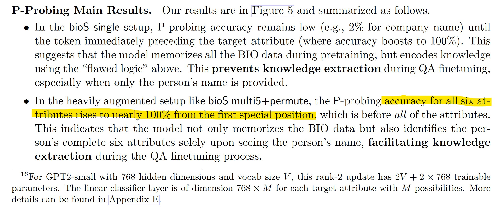

## Result 1: Mixed training ⇒ knowledge extraction.

pretraining a model on `all biographies plus QAs` for a p fraction of individuals together enables it to (apply knowledge to) answer questions about the remaining 1 − p fraction. We call this process mixed training.

We observe in mixed training, the model `first uses QAs to encode knowledge about the p fraction`, then `correlates this encoded knowledge with the biography` to infer generalization to the remaining 1 − p fraction. This learning process deviates from typical human learning and is less frequently used in practical LLM pretrain (and perhaps it should!).


## Result 2-3: Instruct finetune ⇏ knowledge extraction (unless `data augmented`).

Consider a model pretrained only on the biographies and then finetuned using QAs for a p fraction of individuals. We discover that it struggles to answer questions about the remaining 1−p fraction, irrespective of model size, pre-train time, or finetune parameters (Result 2).

However, accuracy significantly improves with `knowledge augmentations` like varying writing styles or sentence shuffling (Result 3). This gives a strong link between knowledge augmentation in the pretrain data and the model’s knowledge extraction ability after finetuning.

`knowledge augmentations` is `data augmented`


## Result 4-5: Introduce probing techniques to explain Why this happens.

knowledge augmentation pushes the model to encode a person’s knowledge almost linearly in the model’s hidden embedding of the `person’s name tokens`. Without augmentation, the model encodes the person’s knowledge across all biography words/tokens, making knowledge extraction nearly impossible no matter how one finetunes it. In sum:

- no knowledge augmentation in pretrain data 
⇐⇒ attribute is not entirely stored on person’s names when the model memorizes the pretrain data
⇐⇒ knowledge cannot be extracted via instruction finetune

- knowledge augmented in pretrain data 
⇐⇒ attribute is `nearly entirely stored on person’s names`
⇐⇒ knowledge can be extracted via instruction finetune


## Result 6: Knowledge augmentation on the “celebrity” helps “minority”.

Even if knowledge augmentation is applied to a subset of individuals, what we call celebrities,
test accuracy for others (without augmentation) also increases significantly. We discover that
the mere inclusion of celebrity data (e.g., people with plentiful online biographical data of
diverse writing styles) in pre-training enhances the model’s knowledge extraction for minorities


## Practical Implications

### emphasize the importance of pre-training data rewriting (augmentation)
particularly for rare but critical data.

Tools such as Llama-7B or even smaller auxiliary models are adequate for this rewriting task.
These “rewrite models” do not need to possess the knowledge themselves. As demonstrated,
simple `sentence-level shuffling` or `English-to-French translations` can already enhance performance.
Generally, we suggest including prompts that encourage sentence shuffling when using such rewrite models.

data rewriting — what we call knowledge augmentation — helps language models to memorize knowledge in a more accessible format for downstream tasks. Without such augmentation, the accuracy even for the simplest knowledge extraction task, could be near zero.

advantages of including more instruction-finetuned data during pre-training. Our mixed training experiments show that postponing all QA-like data to the fine-tuning phase is suboptimal. **Introducing QA-like data earlier in pre-training enables the model to encode knowledge more effectively.**

- - -

## Dataset

**BIO dataset bioS.** The synthetic dataset, bioS, generates profiles for:
- N = 100,000 individuals

Ví dụ (rất nhiều facts):
> __Anya Briar Forger__ was born on __October 2, 1996__. She spent her early years in __Princeton, NJ__. She received mentorship and guidance from faculty members at __Massachusetts Institute of Technology__. She completed her education with a focus on __Communications__. She had a professional role at __Meta Platforms__. She was employed in __Menlo Park, CA__.

We also explore 3 types of knowledge augmentations: (1) multiM , generating M biography entries
for an individual using varied templates, (2) fullname, substituting he/she/they with the person’s
full name; and (3) permute, shuffling the six sentences randomly.

**BIO dataset bioR.** We examine a “close-to-real” dataset produced by Llama. For the set of N = 100,000 individuals, we provide an instructive prompt to Llama to generate a biographical entry. Here’s an example:

> __Anya Briar Forger__ is a renowned social media strategist and community manager. She is currently working as a Marketing Manager at __Meta Platforms__. She completed her graduation from __MIT__ with a degree in __Communications__. She was born on __2nd October 1996__ in __Princeton, NJ__ and was brought up in the same city. She later moved to __Menlo Park in California__ to be a part of Facebook’s team. She is an avid reader and loves traveling.

**QA Dataset**
```sh
1. What is the birth date of Anya Briar Forger?
Answer: October 2, 1996.

2. What is the birth city of Anya Briar Forger?
Answer: Princeton, NJ.

3. Which university did Anya Briar Forger study?
Answer: Massachusetts Institute of Technology.

4. What major did Anya Briar Forger study?
Answer: Communications.

5. Which company did Anya Briar Forger work for?
Answer: Meta Platforms.

6. Where did Anya Briar Forger work?
Answer: Menlo Park, CA.
```

- - -





