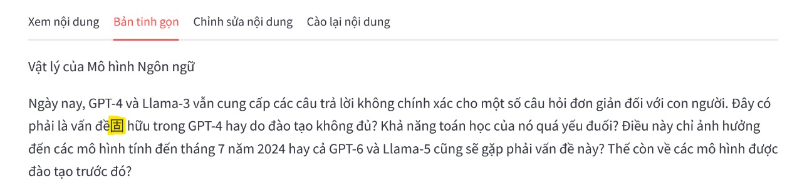

## Tỉa và mapping vocab sao cho model chỉ sinh ra tiếng Anh và Việt
- Các open source LLMs hiện tại khi dịch Anh, Việt thi thoảng model output tiếng Tàu
- Bộ từ vựng Anh Việt có lẽ chỉ chiếm 1/2 trong tổng số 100k - 200k vocab size.
  Khi tỉa gọn lại thì sẽ giúp:
  - Không thể ouptut tokens nào khác ngoài En hoặc Vi
  - Giảm vram khi infer và finetune embeddings
  - Tăng tốc độ infer và finetune

*llama 3.1 405b vẫn hallu ra tiếng Trung trong tác vụ dịch Anh Việt*

**Cách làm**
- Tạo En, Vi dataset chứa các tài liệu tiếng Anh Việt và giả sử đó là toàn bộ nội dung của 2 ngôn ngữ

- Dùng En, Vi dataset trên chạy qua tokenizer để lọc lấy những tokens chỉ thuộc về En và Vi
  => Mảng `used_token_ids`

- Dồn embedding bằng cách map `used_token_ids[i] => i` (original token id => new token id)

**Tham khảo**
- https://github.com/huggingface/transformers/pull/31292
  - Llama3 8B -> MIND-BLOWING 3.62 memory usage reduction factor (due to large vocabulary)

- https://github.com/huggingface/transformers/issues/30860

- https://huggingface.co/5CD-AI/visocial-T5-base
  trimmed vocabulary size to 50,589 and continually pretrained google/mt5-base on a merged 20GB dataset

**Triển khai**
- [x] Dataset
- [x] Lọc theo thống kê mới giảm được gần một nửa 86k / 151k (qwen vocab)
  - bị mất một số emoji
- [x] Cần kết hợp với lọc theo bảng mã unicode
  - giữ lại emoji
  - loại bỏ cjk, thailand, chữ tượng hình ...
- [x] Target bộ từ vựng ~96k (63%)

- [x] Lọc sâu hơn nữa, target bộ từ vựng ~80k (50%)
  - [x] Giữ lại tokens chứa ký tự tiếng Việt
  - [x] Giữ lại ascii tokens

- [x] Tạo final vocab từ [qwen__800__20000](./qwen__800__20000/README.md)
  - [x] Lọc tay kept tokens @ `tokens_kept__*.jsonl` (84065 giảm xuống 76116)

**Đối tượng thực hành**
- qwen2.5 có 0.5b, 1.5b, 3b, 7b, 14b, `32b`, `72b` models
- llama3.x có 1b, 3b, 8b, `70b`, 405b models
- gemma2 có 2b, 9b, `27b` models
- Các model được đánh giấu có chất lượng tốt và có thể quant để chạy trên 24G hoặc 40G vram

- [ ] Kiểm tra xem vocab của họ nhà qwen có giống nhau 100% không?
  - `qwen2.5` https://huggingface.co/Qwen/Qwen2.5-14B-Instruct
  - `qwen2.0` https://huggingface.co/SeaLLMs/SeaLLMs-v3-7B-Chat
  - `qwen1.5` https://huggingface.co/5CD-AI/Viet-Sailor-4B-Instruct

- [ ] Thêm special tokens vào `qwen__800__20000/tokens_kept__*` để tạo new vocab

- [ ] Thử cắt tỉa qwen2.5 1.5b và chạy inference

- [ ] Sửa code llama.cpp python hoặc exllama để có thể chạy đc model đã sửa vocab

- - -

## Sau khi tỉa gọn rồi từng bước một mở rộng bộ vocab

- tạo bộ từ điển từ ghép tiếng Việt thông dụng, chỉ cần khoảng 2k - 8k từ
- dùng một bộ lọc trước lúc tknz để lọc và map từ ghép này vào token id mới
- dùng một cách thông minh để khởi tạo embedding values của tokens mới
  - Zero-Shot Tokenizer Transfer https://github.com/bminixhofer/zett
- dùng lora finetune để refine new embeddings
  - freeze all layers, finetune embeddings trước
  - sau đó finetune all models
  - build datasets và giáo án huấn luyện phù hợp
  - ...
- ...

- - -

## Physics of LMs: làm thí nghiệm về Knowledge Storage, Extraction and Manipulation

## Physics of LMs: làm thí nghiệm [TinyStories](./TINY_STORIES.md) để học language
- Mở rộng: xây bộ data để chuyển knowledge đã học từ En => Vi

## Physics of LMs: làm thí nghiệm [TinyGSM](./TINY_GSM.md) để học cách làm toán
- Mở rộng: kết hợp với các thử nghiệm về reasoning trong physics of LMs part 2.

