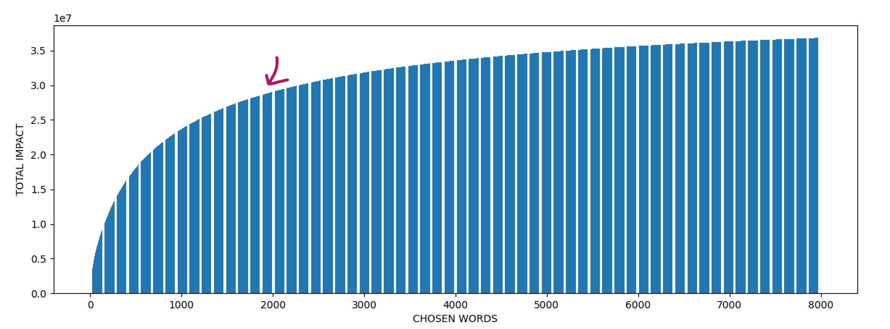
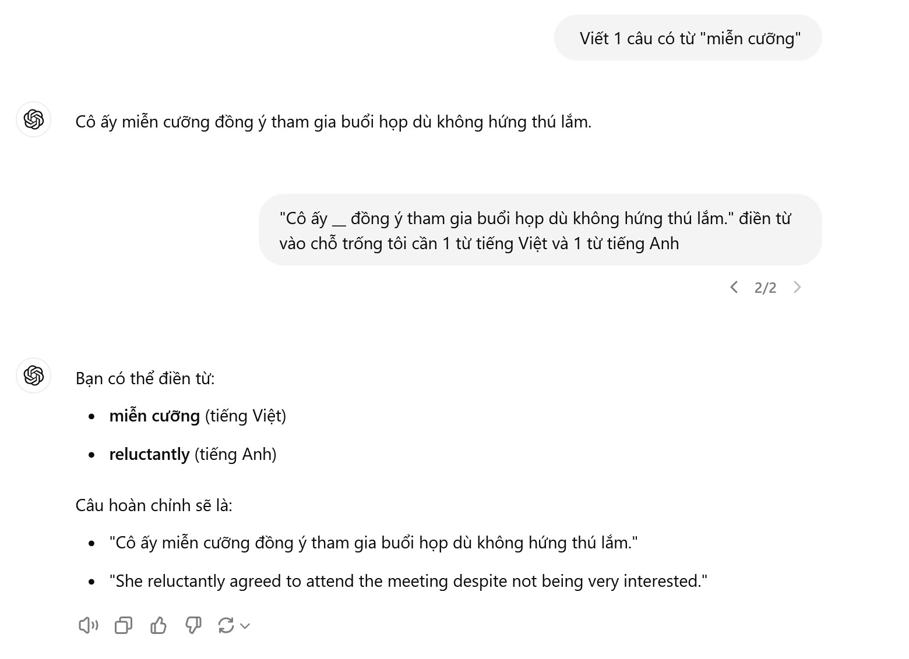
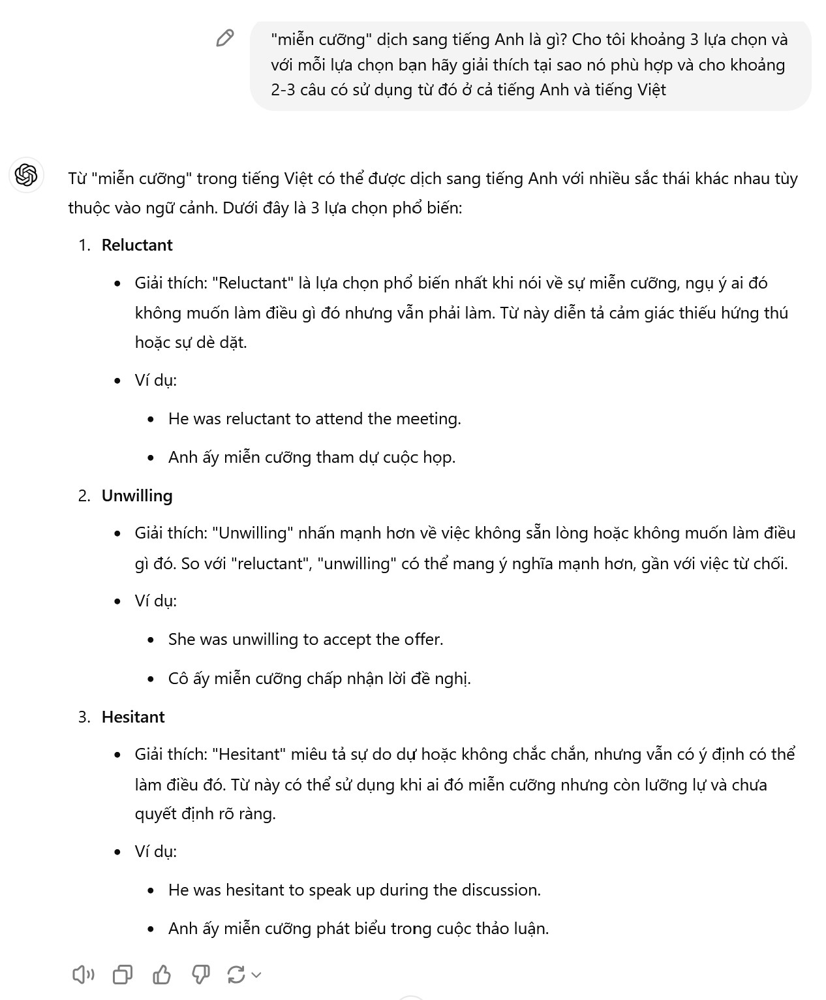
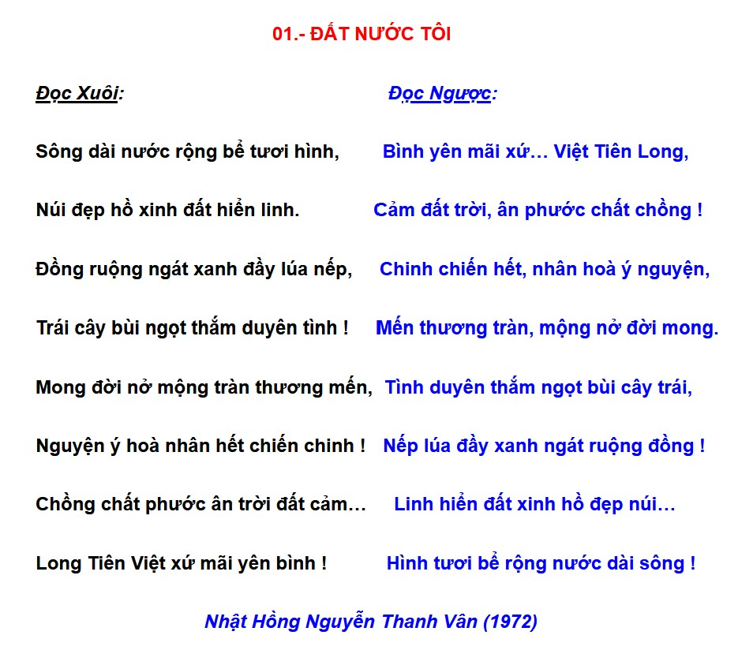

## Tỉa và mapping vocab sao cho model chỉ sinh ra tiếng Anh và Việt
- Các open source LLMs hiện tại khi dịch Anh, Việt thi thoảng model output tiếng Tàu
- Bộ từ vựng Anh Việt có lẽ chỉ chiếm 1/2 trong tổng số 100k - 200k vocab size.
  Khi tỉa gọn lại thì sẽ giúp:
  - Không thể ouptut tokens nào khác ngoài En hoặc Vi
  - Giảm vram khi infer và finetune embeddings
  - Tăng tốc độ infer và finetune


*llama 3.1 405b vẫn hallu ra tiếng Trung trong tác vụ dịch Anh Việt*

**Cách làm**
- Tạo En, Vi dataset chứa các tài liệu tiếng Anh Việt và giả sử đó là toàn bộ nội dung của 2 ngôn ngữ

- Dùng En, Vi dataset trên chạy qua tokenizer để lọc lấy những tokens chỉ thuộc về En và Vi
  => Mảng `used_token_ids`

- Dồn embedding bằng cách map `used_token_ids[i] => i` (original token id => new token id)

**Tham khảo tác dụng của giảm tải vocab và can thiệp vào inference**
- https://github.com/huggingface/transformers/pull/31292
  - Llama3 8B -> MIND-BLOWING 3.62 memory usage reduction factor (due to large vocabulary)

- https://github.com/huggingface/transformers/issues/30860

- https://huggingface.co/5CD-AI/visocial-T5-base
  trimmed vocabulary size to 50,589 and continually pretrained google/mt5-base on a merged 20GB dataset

- https://github.com/sam-paech/antislop-sampler given a list of words & phrases to avoid like 
  "a tapestry of", "a testament to", etc., and it will backtrack and try something else if it hits that phrase.

**Triển khai**
- [x] Dataset
- [x] Lọc theo thống kê mới giảm được gần một nửa (qwen vocab)
  - bị mất một số emoji
- [x] Cần kết hợp với lọc theo bảng mã unicode
  - giữ lại emoji
  - loại bỏ cjk, thailand, chữ tượng hình ...
- [x] Target bộ từ vựng ~96k (63%)
- [x] Tạo final vocab từ [qwen__1000__20000](./qwen__1000__20000/README.md)

**Đối tượng thực hành**
- qwen2.5 có 0.5b, 1.5b, 3b, 7b, 14b, `32b`, `72b` models
- llama3.x có 1b, 3b, 8b, `70b`, 405b models
- gemma2 có 2b, 9b, `27b` models
- Các model được đánh giấu có chất lượng tốt và có thể quant để chạy trên 24G hoặc 40G vram

- [ ] Kiểm tra xem vocab của họ nhà qwen có giống nhau 100% không?
  - `qwen2.5` https://huggingface.co/Qwen/Qwen2.5-14B-Instruct
  - `qwen2.0` https://huggingface.co/SeaLLMs/SeaLLMs-v3-7B-Chat
  - `qwen1.5` https://huggingface.co/5CD-AI/Viet-Sailor-4B-Instruct

- [x] Thêm special tokens vào `qwen__1000__20000/tokens_kept__*` để tạo new vocab

- [x] Thử cắt tỉa qwen2.5 1.5b và chạy inference

- [ ] Sửa code llama.cpp python hoặc exllama để có thể chạy đc model đã sửa vocab

```sh
huggingface-cli download Qwen/Qwen2.5-1.5B-Instruct --local-dir ../Qwen2.5-1.5B-Instruct

python3 model_edit.py -m ../Qwen2.5-1.5B-Instruct -t trimm_vocab

python3 model_chat.py ../Qwen2.5-1.5B-Instruct
# Bạn: Translate following sentence into Chinese: tôi tên là Lý Quốc Dân
# Bot: 我的名字是李国定
# ../Qwen2.5-1.5B-Instruct: timespent 1.31 seconds

python3 model_chat.py ../Qwen2.5-1.5B-Instruct__trimm_vocab
# Bạn: Translate following sentence into Chinese: tôi tên là Lý Quốc Dân
# Bot: My name is Li Guo Dan.
# ../Qwen2.5-1.5B-Instruct__trimm_vocab: timespent 1.31 seconds
```
Vì bộ vocab mới chỉ hỗ trợ tiếng Anh và Việt là chính nên qwen không thể nói tiếng Trung được nữa

- - -

## Physics of LMs: Sau khi tỉa gọn, từng bước một mở rộng vocab

- [x] tạo bộ từ điển từ ghép tiếng Việt thông dụng và chiếm nhiều tokens nhất, chỉ cần khoảng < 10k
  - Dùng https://github.com/trungtv/pyvi để tách từ
```sh
# `impact = freq * (qwen_tokens_count - 1)` (`freq` là tần suất sử dụng của từ đó trong corpus)
xzcat data/vi_words_impact.jsonl.xz | head -n 10
{"word": "có▁thể",     "impact": 328134, "qwen_tokens": ["có", " thể"], "freq": 328134, "qwen_tokens_count": 2}
{"word": "sử▁dụng",    "impact": 145168, "qwen_tokens": [" sử", " dụng"], "freq": 145168, "qwen_tokens_count": 2}
{"word": "thời▁gian",  "impact": 140172, "qwen_tokens": [" thời", " g", "ian"], "freq": 70086, "qwen_tokens_count": 3}
{"word": "Tại▁sao",    "impact": 109010, "qwen_tokens": [" Tại", " sa", "o"], "freq": 54505, "qwen_tokens_count": 3}
{"word": "Việt▁Nam",   "impact": 98771, "qwen_tokens": [" Việt", " Nam"], "freq": 98771, "qwen_tokens_count": 2}
{"word": "Hoa▁Kỳ",     "impact": 97200, "qwen_tokens": ["H", "oa", " Kỳ"], "freq": 48600, "qwen_tokens_count": 3}
{"word": "Tuy▁nhiên",  "impact": 94114, "qwen_tokens": ["T", "uy", " nhiên"], "freq": 47057, "qwen_tokens_count": 3}
{"word": "nghiên▁cứu", "impact": 83673, "qwen_tokens": [" nghiên", " cứu"], "freq": 83673, "qwen_tokens_count": 2}
{"word": "thay▁đổi",   "impact": 79270, "qwen_tokens": ["th", "ay", " đổi"], "freq": 39635, "qwen_tokens_count": 3}
{"word": "hoạt▁động",  "impact": 77248, "qwen_tokens": [" hoạt", " động"], "freq": 77248, "qwen_tokens_count": 2}

xzcat data/vi_words_impact.jsonl.xz | head -n 1000 | tail -n 10 
{"word": "Quân▁đoàn",  "impact": 5030, "qwen_tokens": [" Quân", " đoàn"], "freq": 5030, "qwen_tokens_count": 2}
{"word": "Tương▁tự",   "impact": 5028, "qwen_tokens": ["T", "ương", " tự"], "freq": 2514, "qwen_tokens_count": 3}
{"word": "Tư▁lệnh",    "impact": 5025, "qwen_tokens": [" Tư", " lệnh"], "freq": 5025, "qwen_tokens_count": 2}
{"word": "hương▁vị",   "impact": 5017, "qwen_tokens": [" hương", " vị"], "freq": 5017, "qwen_tokens_count": 2}
{"word": "thị▁xã",     "impact": 5016, "qwen_tokens": [" thị", " xã"], "freq": 5016, "qwen_tokens_count": 2} 
{"word": "con▁số",     "impact": 5011, "qwen_tokens": ["con", " số"], "freq": 5011, "qwen_tokens_count": 2}  
{"word": "đánh▁dấu",   "impact": 5011, "qwen_tokens": [" đánh", " dấu"], "freq": 5011, "qwen_tokens_count": 2}
{"word": "lạm▁dụng",   "impact": 5010, "qwen_tokens": ["l", "ạm", " dụng"], "freq": 2505, "qwen_tokens_count": 3}
{"word": "dân▁chủ",    "impact": 5001, "qwen_tokens": [" dân", " chủ"], "freq": 5001, "qwen_tokens_count": 2}
{"word": "hiến▁pháp",  "impact": 5000, "qwen_tokens": ["hi", "ến", " pháp"], "freq": 2500, "qwen_tokens_count": 3}

xzcat data/vi_words_impact.jsonl.xz | head -n 2000 | tail -n 10 
{"word": "nhân▁khẩu",  "impact": 2388, "qwen_tokens": [" nhân", " khẩu"], "freq": 2388, "qwen_tokens_count": 2}
{"word": "tinh▁trùng", "impact": 2386, "qwen_tokens": ["t", "inh", " trùng"], "freq": 1193, "qwen_tokens_count": 3}
{"word": "bồi▁dưỡng",  "impact": 2386, "qwen_tokens": ["b", "ồi", " dưỡng"], "freq": 1193, "qwen_tokens_count": 3}
{"word": "Tòa▁Thánh",  "impact": 2386, "qwen_tokens": ["T", "òa", " Thánh"], "freq": 1193, "qwen_tokens_count": 3}
{"word": "thứ▁tự",     "impact": 2384, "qwen_tokens": [" thứ", " tự"], "freq": 2384, "qwen_tokens_count": 2} 
{"word": "The▁review", "impact": 2383, "qwen_tokens": ["The", " review"], "freq": 2383, "qwen_tokens_count": 2}
{"word": "sai▁lệch",   "impact": 2382, "qwen_tokens": [" sai", " lệ", "ch"], "freq": 1191, "qwen_tokens_count": 3}
{"word": "Tham▁mưu",   "impact": 2382, "qwen_tokens": ["Th", "am", " m", "ưu"], "freq": 794, "qwen_tokens_count": 4}
{"word": "quý▁tộc",    "impact": 2382, "qwen_tokens": [" quý", " tộc"], "freq": 2382, "qwen_tokens_count": 2}
{"word": "Hậu▁Giang",  "impact": 2379, "qwen_tokens": ["H", "ậu", " Gi", "ang"], "freq": 793, "qwen_tokens_count": 4}
```


=> **Chọn khoảng 1k - 2k từ ghép để mở rộng vocab là đủ tạo impact**

- [x] lọc và map những từ ghép này vào token ids mới

- [x] tìm các cách *hiệu quả* để khởi tạo embedding values của tokens mới => sử dụng embedding của từ TA tương đương!
  - Với 1 từ được chọn, tìm ra 1-3 câu liên quan tới từ đó:
    - thay toàn bộ embedding values của từ được chọn băng 01 embedding value mới được init bằng nhiều cách:
      - embedding value của từ đơn tương ứng trong tiếng Anh
      - lấy trung bình cộng của các embedding values của các tokens của từ đó
      - lấy trung bình cộng của toàn bộ embedding values của các từ `gần` với nó (trong TV và các ngôn ngữ khác)
        `gần` ở đây có thể là về ý nghĩa, về embdding values hoặc bất kỳ độ đo hợp lý nào ...
  - làm thế nào để đo lường được *hiệu quả*?
    - tính sự khác biệt của output (logits diff / perpelexity ...) trong các phép thay thế,
    khác biệt thấp nhất => hiệu quả nhất?
  - Việc lựa chọn embedding values có thực sự quan trọng? Vì đằng nào cũng cần continue pretrain.

- [x] Sinh dữ liệu tổng hợp giúp tạo và massage new embeddings cho ~1k từ tại `data/vi_words_similarity.jsonl`

- [ ] Mát xa new embeddings (giữ nguyên old embeddings)
  - [ ] Sau khi tune new embeddings, cần thay thế giá trị gốc của old embeddings,
    ở cuối chu kỳ update params hoặc sau khi train xong.

- [ ] freeze *most* layers, finetune embeddings và vài low layers trước
    - Lý do: từ vựng, ngữ pháp, các skills ngôn ngữ tập trung nhiều ở low layers

- [ ] sau đó finetune toàn bộ model (lora + embedding or full finetune)
  - [x] `./finetune_qwen__3_final.sh` hỗ trợ 7b trên 40g vram
  - [ ] kịch bản lora cho 14b model, có thể phải dồn vocab để chạy được trên 40g vram
    - Nên lora base model? vì chiến lược merge dưới đây sẽ cho hiệu quả tốt?
      https://docs.google.com/document/u/0/d/1OjbjU5AOz4Ftn9xHQrX3oFQGhQ6RDUuXQipnQ9gn6tU/mobilebasic

- [x] build datasets và giáo án huấn luyện phù hợp
  - [x] `trimm vocab` 7b model https://huggingface.co/Symato/Qwen2.5-7B-Instruct__trimm_vocab
  - [ ] `trimm and extend vocab` 7b model ...
  - [ ] `original vocab` 14b model


```sh
python3 model_edit.py -t trimm_vocab

# `101011` làm tròn `101056` => 101011 - 101055 không dùng tới => kiểm tra xem embedding của nó có thay đổi không.
# Hãy gán nó == 0 để dễ check.

python3 model_edit.py -m ../Qwen2.5-1.5B-Instruct__trimm_vocab -t extend_vocab


```

- - -

Bài toán: cho một từ (ví dụ "thực hiện") là thế nào để tìm ra một embding value mà khi dùng nó để thay thế chuỗi tokens
"qwen_tokens": [" thực", " hiện"] trong các đoạn text mà nó xuất hiện thì không làm thay đổi `đầu ra` của model.

Đầu ra ở đây là một giá trị càng gần 0 càng tốt (0 = không thay đổi), có thể là logits diff hoặc perplexity, 

Bạn: tạo ra một câu hoàn chỉnh với từ "thực hiện"
Bot: "Tôi đã thực hiện kế hoạch của mình thành công."

Giờ ta sẽ mask từ "thực hiện" và được "Tôi đã ___ kế hoạch của mình thành công.", 
giờ ta để LLM tự điền vào chỗ trống 01 token thì liệu nó có tìm ra token có embedding value hợp lý nhất cho từ "thực hiện" không?

Hidden value (embedding) ở layer cuối, khi nhân với lm_head để tạo logits và chọn ra vị trí có logits cao nhất làm token_id, lm_head value ở ví trí đó với qwen 1.5 chính là embedding value vì qwen 1.5 dùng tied embeddings.





- - -

## Kỹ thuật dồn vocab khi finetune

Khi finetune trên 1 tập domain data nhỏ (vài GB) sẽ không dùng hết 100k - 200k vocab, => 
lọc tokens thực sự dùng trong data (1/4 - 1/2), dồn embeddings lại và chỉ train trên những embeddings đó.
Sau khi train xong lại re-map và merge vào vocab gốc.

Ưu: 
- Save vram while training! (embeddings ở định dạng f32 nên khá tốn)
- không làm ảnh hưởng bộ tknz gốc

Nhược:
- Các embeddings khác không được tune? có bị ảnh hưởng? 
  Embeddings ko dùng => ko activate => ko cần update gradient? Cần confirm = code.

**TODOs**
- [ ] Check xem các embeddings không dùng có bị update gradient không?

- - -

## Thử nghiệm In-context Pretraining xem khi trộn lẫn training sample trong ctxlen ảnh hưởng gì tới model?
- trộn ngẫu nhiên
- trộn có tính toán https://arxiv.org/abs/2310.10638
- không trộn (mỗi sample 1 ctxlen hoặc dùng packed dataset)

## Thử nghiệm Block Expansion
- https://arxiv.org/abs/2401.02415v2

## Thử nghiệm Layer Swapping
- https://arxiv.org/abs/2410.01335

## Thử nghiệm Memory Tuning để khử hallu
- https://arxiv.org/abs/2406.17642

- LLMs augmented with a massive Mixture of Memory Experts (MoME) can easily memorize large datasets

- simple neural networks trained to predict the next token hallucinate when the training loss 
  is above a threshold as it usually does in practice when training on internet scale data

- design a model for removing hallucinations that stores facts in a massive mixture of 
  millions of memory experts that are retrieved dynamically

## Physics of LMs: làm thí nghiệm về Knowledge Storage, Extraction and Manipulation

## Physics of LMs: làm thí nghiệm [TinyStories](TinyStories.md) về học languages
- Build dataset theo một hướng khác? TinyFantasy? TinyFunny?
- Mở rộng: xây bộ data để chuyển knowledge đã học từ Vi => En
- Mở rộng: Từ hiểu ngôn ngữ tới làm thơ và làm thơ thuận nghịch độc
  - https://nhathongnguyenthanhvan.wordpress.com/2018/03/20/nhung-bai-tho-thuan-nghich-doc
  - Nên bắt đầu với dataset thuận nghịch độc, các câu ngắn đọc xuôi hay ngược đều có ý nghĩa
- Ý tưởng: dùng kỹ thuật FIM (fill in middle) của code LLM để tạo thơ có vần
  Yêu cầu chữ cuối phải rơi vào 1 từ hoặc 1 vần nào đó ...


