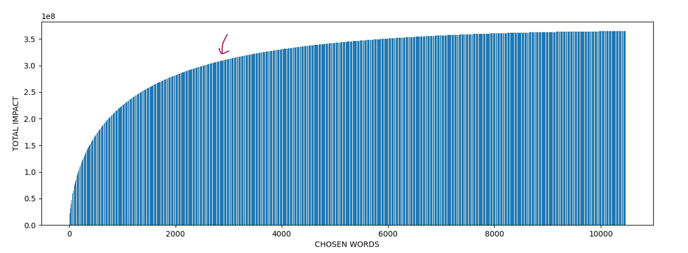

## Tỉa và mapping vocab sao cho model chỉ sinh ra tiếng Anh và Việt
- Các open source LLMs hiện tại khi dịch Anh, Việt thi thoảng model output tiếng Tàu
- Bộ từ vựng Anh Việt có lẽ chỉ chiếm 1/2 trong tổng số 100k - 200k vocab size.
  Khi tỉa gọn lại thì sẽ giúp:
  - Không thể ouptut tokens nào khác ngoài En hoặc Vi
  - Giảm vram khi infer và finetune embeddings
  - Tăng tốc độ infer và finetune


*llama 3.1 405b vẫn hallu ra tiếng Trung trong tác vụ dịch Anh Việt*

**Cách làm**
- Tạo En, Vi dataset chứa các tài liệu tiếng Anh Việt và giả sử đó là toàn bộ nội dung của 2 ngôn ngữ

- Dùng En, Vi dataset trên chạy qua tokenizer để lọc lấy những tokens chỉ thuộc về En và Vi
  => Mảng `used_token_ids`

- Dồn embedding bằng cách map `used_token_ids[i] => i` (original token id => new token id)

**Tham khảo tác dụng của giảm tải vocab và can thiệp vào inference**
- https://github.com/huggingface/transformers/pull/31292
  - Llama3 8B -> MIND-BLOWING 3.62 memory usage reduction factor (due to large vocabulary)

- https://github.com/huggingface/transformers/issues/30860

- https://huggingface.co/5CD-AI/visocial-T5-base
  trimmed vocabulary size to 50,589 and continually pretrained google/mt5-base on a merged 20GB dataset

- https://github.com/sam-paech/antislop-sampler given a list of words & phrases to avoid like 
  "a tapestry of", "a testament to", etc., and it will backtrack and try something else if it hits that phrase.

**Triển khai**
- [x] Dataset
- [x] Lọc theo thống kê mới giảm được gần một nửa (qwen vocab)
  - bị mất một số emoji
- [x] Cần kết hợp với lọc theo bảng mã unicode
  - giữ lại emoji
  - loại bỏ cjk, thailand, chữ tượng hình ...
- [x] Target bộ từ vựng ~96k (63%)

- [x] Lọc sâu hơn nữa, target bộ từ vựng ~80k (50%)
  - [x] Giữ lại tokens chứa ký tự tiếng Việt
  - [x] Giữ lại ascii tokens

- [x] Tạo final vocab từ [qwen__800__20000](./qwen__800__20000/README.md)
  - [x] Lọc tay kept tokens @ `tokens_kept__*.jsonl` (84065 giảm xuống 76116)

**Đối tượng thực hành**
- qwen2.5 có 0.5b, 1.5b, 3b, 7b, 14b, `32b`, `72b` models
- llama3.x có 1b, 3b, 8b, `70b`, 405b models
- gemma2 có 2b, 9b, `27b` models
- Các model được đánh giấu có chất lượng tốt và có thể quant để chạy trên 24G hoặc 40G vram

- [ ] Kiểm tra xem vocab của họ nhà qwen có giống nhau 100% không?
  - `qwen2.5` https://huggingface.co/Qwen/Qwen2.5-14B-Instruct
  - `qwen2.0` https://huggingface.co/SeaLLMs/SeaLLMs-v3-7B-Chat
  - `qwen1.5` https://huggingface.co/5CD-AI/Viet-Sailor-4B-Instruct

- [x] Thêm special tokens vào `qwen__800__20000/tokens_kept__*` để tạo new vocab

- [x] Thử cắt tỉa qwen2.5 1.5b và chạy inference

- [ ] Sửa code llama.cpp python hoặc exllama để có thể chạy đc model đã sửa vocab

```sh
huggingface-cli download Qwen/Qwen2.5-1.5B-Instruct --local-dir ../Qwen2.5-1.5B-Instruct

python3 qwen_edit.py ../Qwen2.5-1.5B-Instruct

python3 qwen_chat.py ../Qwen2.5-1.5B-Instruct
```
```
new_vocab 76138
Bạn: bạn tên gì?

Tôi là một trợ lý ảo, không có tên riêng.
qwenchat: timespent 0.65 seconds

Bạn: dịch đoạn văn sau sang tiếng Anh: tôi tên là Lý Quốc Dân

Here's the English translation of the Vietnamese text:

"My name is Ly Quoc Dan."

This directly translates the given Vietnamese sentence into English, maintaining its original meanriginal meaning and structure.
qwenchat: timespent 1.15 seconds

Bạn: dịch đoạn văn sau sang tiếng Trung: tôi tên là Lý Quốc Dân

Here's the English translation of the Vietnamese text:

Mr. Tran: My name is Le Quoc Dan.
qwenchat: timespent 0.98 seconds
```
Vì bộ vocab mới chỉ hỗ trợ tiếng Anh và Việt là chính nên qwen không thể nói tiếng Trung được nữa


- - -


## Sau khi tỉa gọn rồi từng bước một mở rộng bộ vocab

- [x] tạo bộ từ điển từ ghép tiếng Việt thông dụng và chiếm nhiều tokens nhất, chỉ cần khoảng < 10k
  - Dùng https://github.com/trungtv/pyvi để tách từ
```sh
# `score = freq * qwen_tokens_count` (`freq` là tần suất sử dụng của từ đó trong corpus)
xzcat data/vi_words_score.jsonl.xz | head -n 10
{"word": "có_thể",         "score": 6078676, "qwen_tokens": [" có", " thể"], "freq": 3039338, "qwen_tokens_count": 2}
{"word": "Việt_Nam",       "score": 3821952, "qwen_tokens": [" Việt", " Nam"], "freq": 1910976, "qwen_tokens_count": 2}
{"word": "thời_gian",      "score": 3292857, "qwen_tokens": [" thời", " g", "ian"], "freq": 1097619, "qwen_tokens_count": 3}
{"word": "thực_hiện",      "score": 2946116, "qwen_tokens": [" thực", " hiện"], "freq": 1473058, "qwen_tokens_count": 2}
{"word": "sử_dụng",        "score": 2707176, "qwen_tokens": [" sử", " dụng"], "freq": 1353588, "qwen_tokens_count": 2}
{"word": "quy_định",       "score": 2670420, "qwen_tokens": [" quy", " định"], "freq": 1335210, "qwen_tokens_count": 2}
{"word": "tổ_chức",        "score": 2597610, "qwen_tokens": [" tổ", " chức"], "freq": 1298805, "qwen_tokens_count": 2}
{"word": "phát_triển",     "score": 2102212, "qwen_tokens": [" phát", " triển"], "freq": 1051106, "qwen_tokens_count": 2}
{"word": "hoạt_động",      "score": 2099536, "qwen_tokens": [" hoạt", " động"], "freq": 1049768, "qwen_tokens_count": 2}
{"word": "doanh_nghiệp",   "score": 2074725, "qwen_tokens": [" do", "anh", " nghiệp"], "freq": 691575, "qwen_tokens_count": 3}

xzcat data/vi_words_score.jsonl.xz | head -n 3000 |  tail -n 10 
{"word": "phê_phán",       "score": 42402, "qwen_tokens": [" phê", " ph", "án"], "freq": 14134, "qwen_tokens_count": 3}
{"word": "miễn_cưỡng",     "score": 42399, "qwen_tokens": [" miễn", " c", "ưỡng"], "freq": 14133, "qwen_tokens_count": 3}
{"word": "mưa_rào",        "score": 42378, "qwen_tokens": [" mưa", " r", "ào"], "freq": 14126, "qwen_tokens_count": 3}
{"word": "định_nghĩa",     "score": 42340, "qwen_tokens": [" định", " nghĩa"], "freq": 21170, "qwen_tokens_count": 2}
{"word": "ảm_đạm",         "score": 42335, "qwen_tokens": [" ", "ả", "m", " đ", "ạm"], "freq": 8467, "qwen_tokens_count": 5}
{"word": "chủng_loại",     "score": 42306, "qwen_tokens": [" ch", "ủng", " loại"], "freq": 14102, "qwen_tokens_count": 3}
{"word": "cực_kì",         "score": 42294, "qwen_tokens": [" cực", " kì"], "freq": 21147, "qwen_tokens_count": 2}
{"word": "Giao_dịch",      "score": 42294, "qwen_tokens": [" G", "iao", " dịch"], "freq": 14098, "qwen_tokens_count": 3}
{"word": "Thỏa_thuận",     "score": 42292, "qwen_tokens": [" Th", "ỏ", "a", " thuận"], "freq": 10573, "qwen_tokens_count": 4}
{"word": "giao_diện",      "score": 42279, "qwen_tokens": [" g", "iao", " diện"], "freq": 14093, "qwen_tokens_count": 3}

xzcat data/vi_words_score.jsonl.xz | tail -n 10
{"word": "tiêu_hoá",       "score": 1004, "qwen_tokens": [" tiêu", " hoá"], "freq": 502, "qwen_tokens_count": 2}
{"word": "Tiến_độ",        "score": 1004, "qwen_tokens": [" Tiến", " độ"], "freq": 502, "qwen_tokens_count": 2}
{"word": "Nhận_biết",      "score": 1004, "qwen_tokens": [" Nhận", " biết"], "freq": 502, "qwen_tokens_count": 2}
{"word": "cơ_may",         "score": 1004, "qwen_tokens": [" cơ", " may"], "freq": 502, "qwen_tokens_count": 2}
{"word": "bất_nhân",       "score": 1004, "qwen_tokens": [" bất", " nhân"], "freq": 502, "qwen_tokens_count": 2}
{"word": "Bà_già",         "score": 1002, "qwen_tokens": [" Bà", " già"], "freq": 501, "qwen_tokens_count": 2}
{"word": "Văn_kiện",       "score": 1002, "qwen_tokens": [" Văn", " kiện"], "freq": 501, "qwen_tokens_count": 2}
{"word": "bàn_là",         "score": 1002, "qwen_tokens": [" bàn", " là"], "freq": 501, "qwen_tokens_count": 2}
{"word": "A_c",            "score": 1000, "qwen_tokens": [" A", " c"], "freq": 500, "qwen_tokens_count": 2}
{"word": "Man_City",       "score": 1000, "qwen_tokens": [" Man", " City"], "freq": 500, "qwen_tokens_count": 2}

```


=> **Chọn 3k - 4k từ ghép để mở rộng vocab là hợp lý, trên 4k độ impact không cao.**

- dùng lọc và map từ ghép này vào token id mới
- dùng một cách thông minh để khởi tạo embedding values của tokens mới
- Vỗ về new embeddings
  - freeze all layers, finetune embeddings trước
  - sau đó finetune models (lora + embedding or full finetune)
  - build datasets và giáo án huấn luyện phù hợp
- ...


- - -


## Physics of LMs: làm thí nghiệm về Knowledge Storage, Extraction and Manipulation

## Physics of LMs: làm thí nghiệm [TinyStories](TinyStories.md) về học language
- Build dataset theo một hướng khác? TinyFantasy? TinyFunny?
- Mở rộng: xây bộ data để chuyển knowledge đã học từ Vi => En
- Mở rộng: Từ hiểu ngôn ngữ tới làm thơ và làm thơ thuận nghịch độc
  - 750 bài thơ thuận nghịch độc https://vantholieuxuyencom.blog/about/
  - Nên bắt đầu với dataset thuận nghịch độc, các câu ngắn đọc xuôi hay ngược đều có ý nghĩa
- Ý tưởng: dùng kỹ thuật FIM (fill in middle) của code LLM để tạo thơ có vần
  Yêu cầu chữ cuối phải rơi vào 1 từ hoặc 1 vần nào đó ...


