- https://www.youtube.com/watch?v=24O1KcIO3FM
- phi-1 https://arxiv.org/pdf/2306.11644
- phi-1.5 https://arxiv.org/pdf/2309.05463
- phi-2 https://neurips.cc/media/neurips-2023/Slides/83968_5GxuY2z.pdf
- phi-2 https://www.microsoft.com/en-us/research/blog/phi-2-the-surprising-power-of-small-language-models

## phi-1
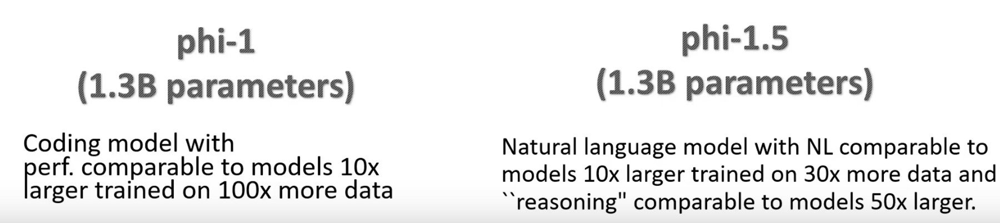

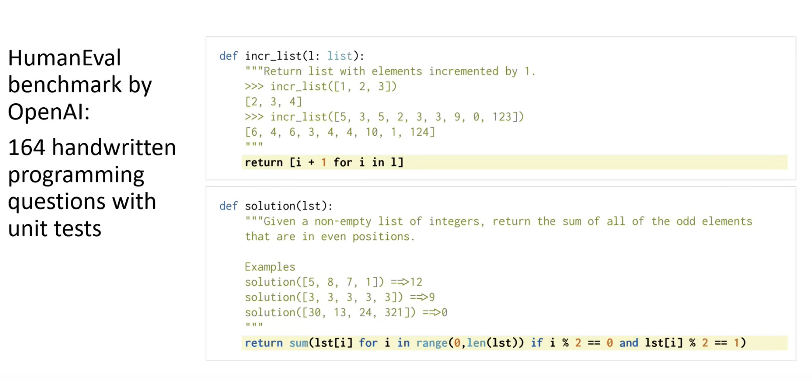

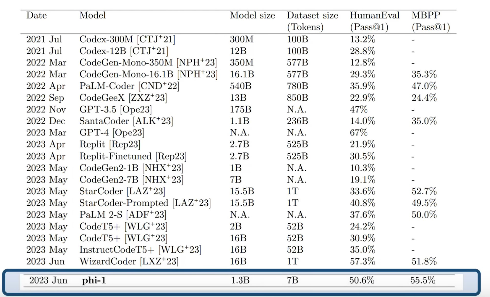

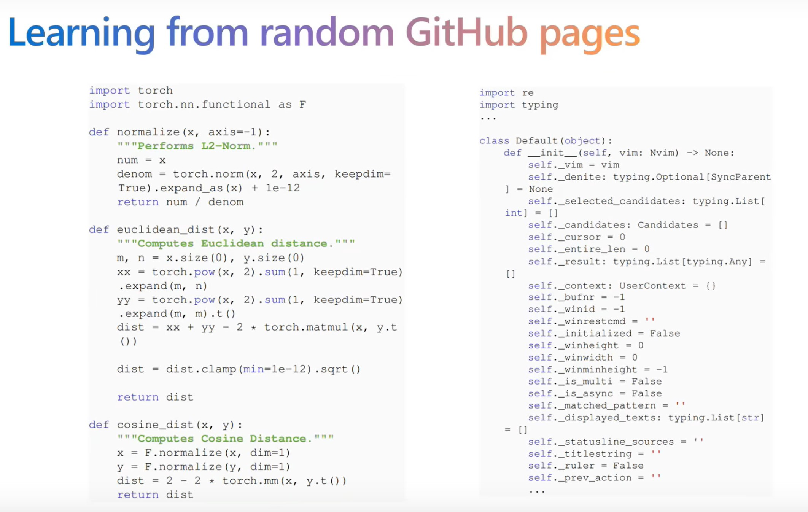
code from internet thường không có giải thích (no docstring, no comments), khó hiểu, khó học ...

**Trước tiên dùng GPT-4 để lọc code trên Internet có chất lượng tốt.**
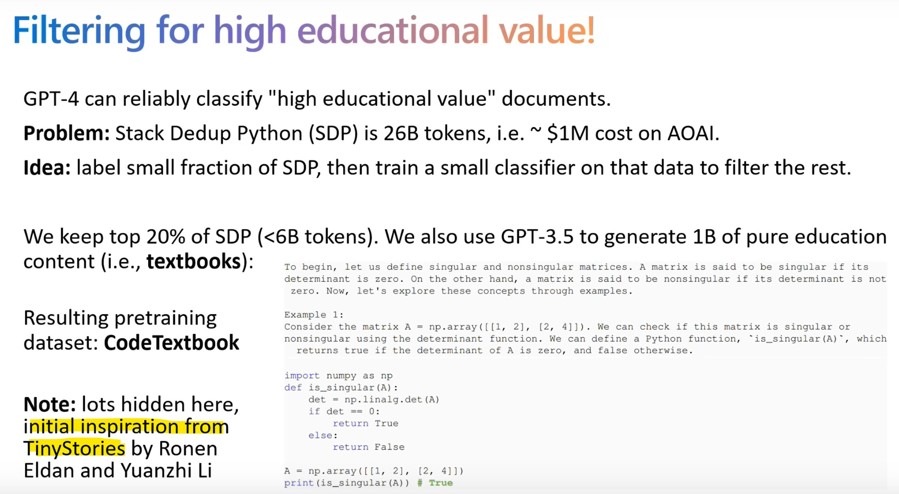

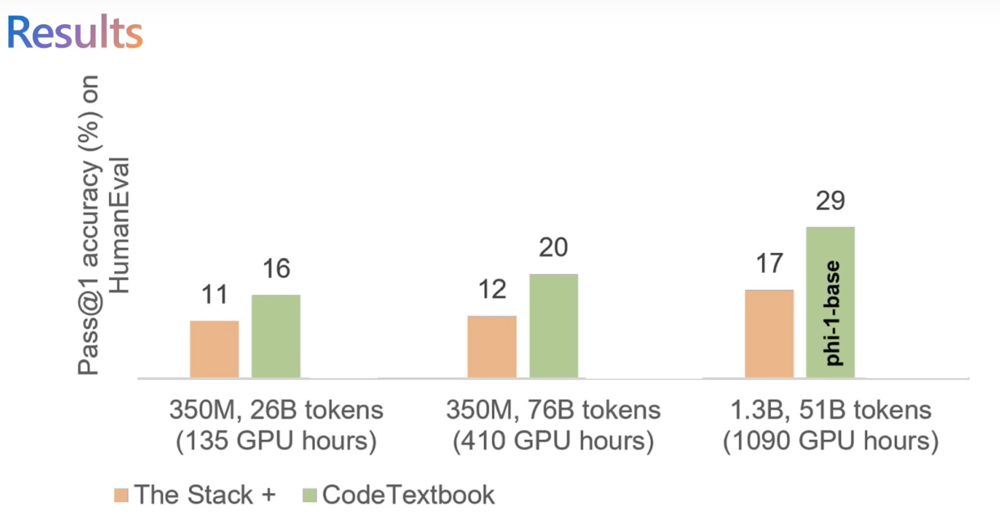

**Ngoài code textbooks, tạo thêm 1 bộ code exercises** (huge benefit)
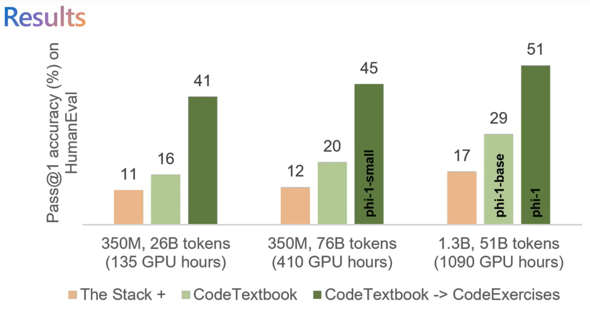

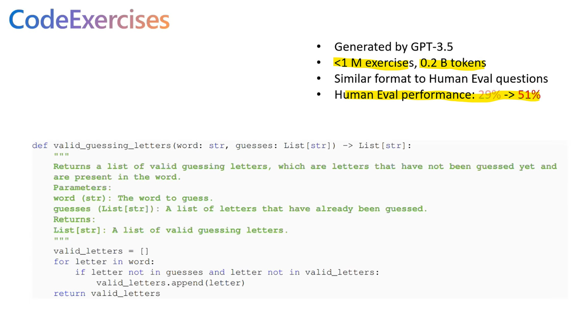

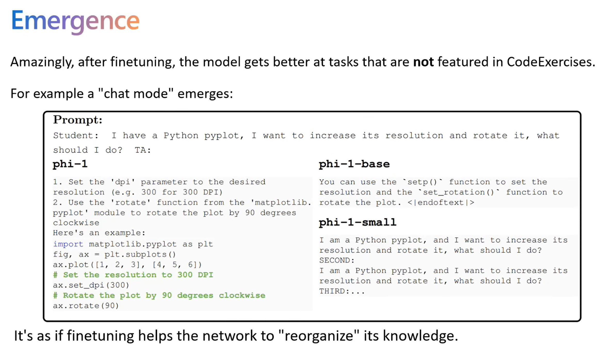

- - -

## phi-1.5
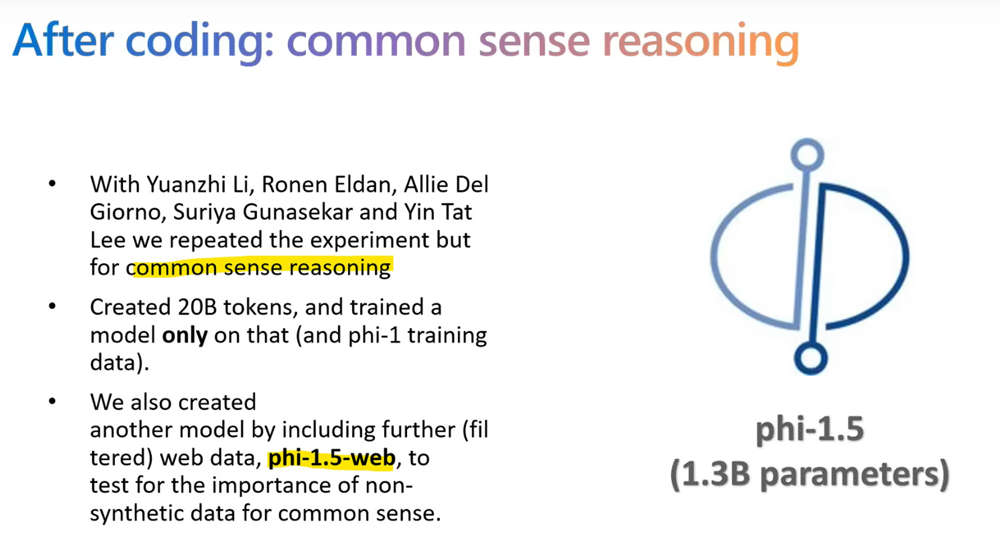

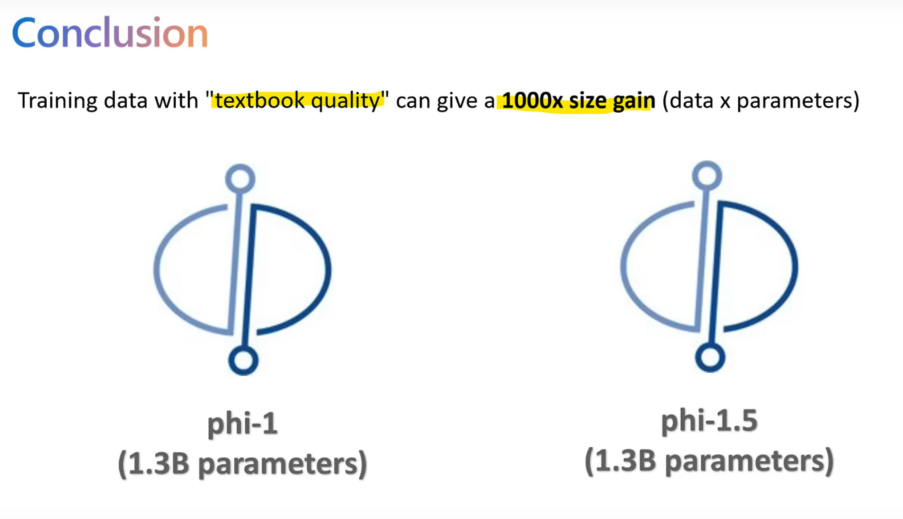

- - -

## phi-2
https://neurips.cc/media/neurips-2023/Slides/83968_5GxuY2z.pdf

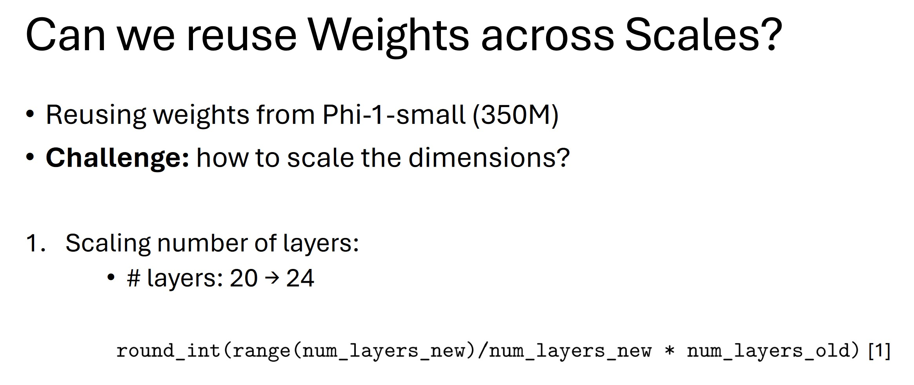
Rae, Jack W., et al. "Scaling language models: Methods, analysis & insights from training gopher.

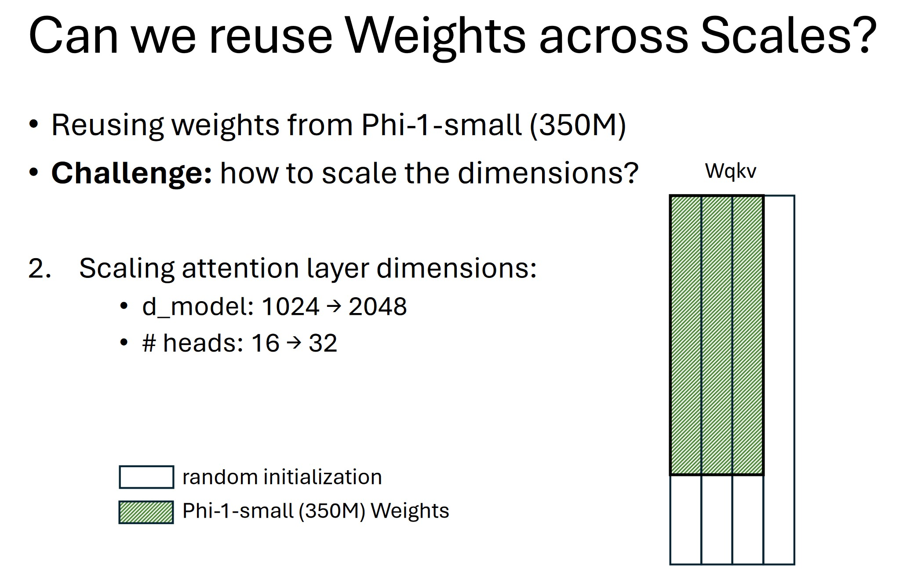

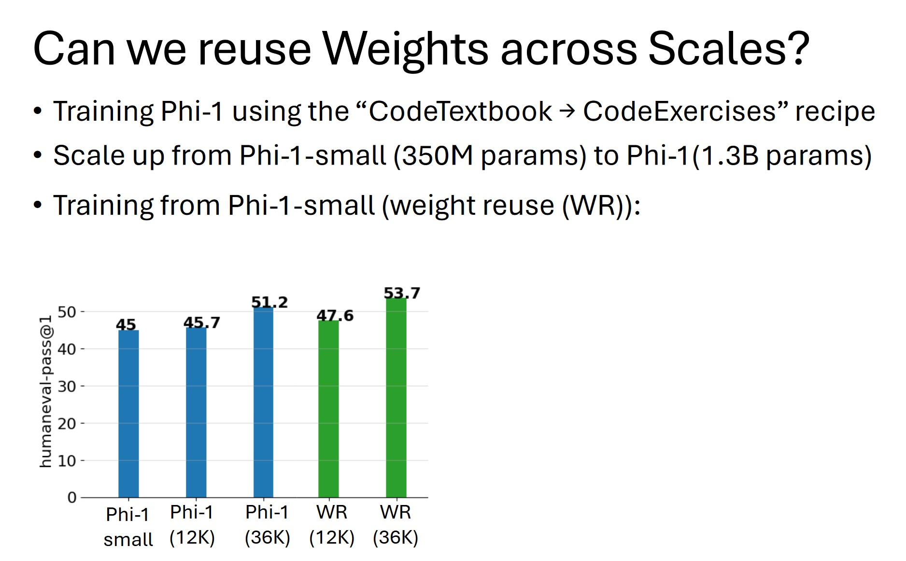

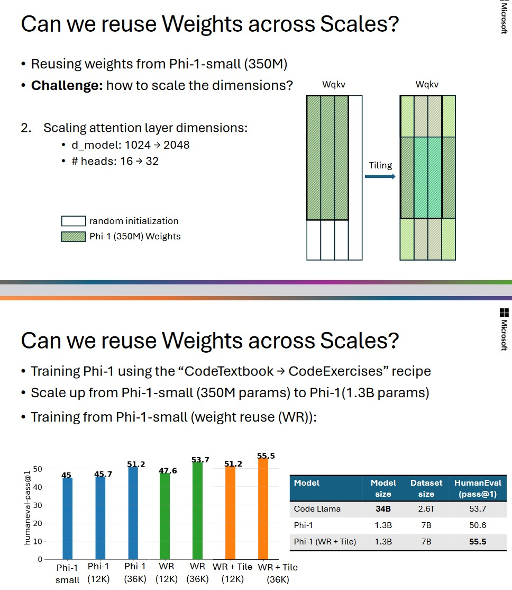

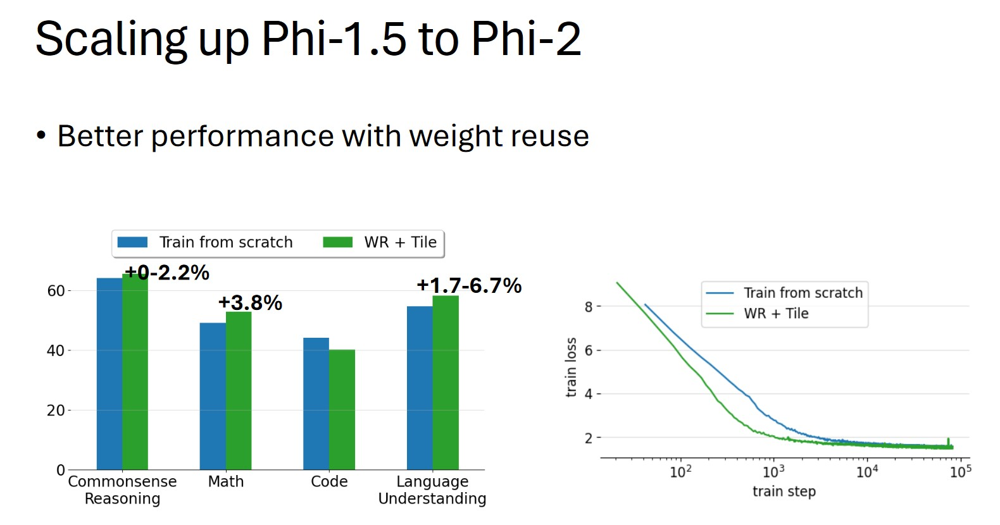

https://www.microsoft.com/en-us/research/blog/phi-2-the-surprising-power-of-small-language-models

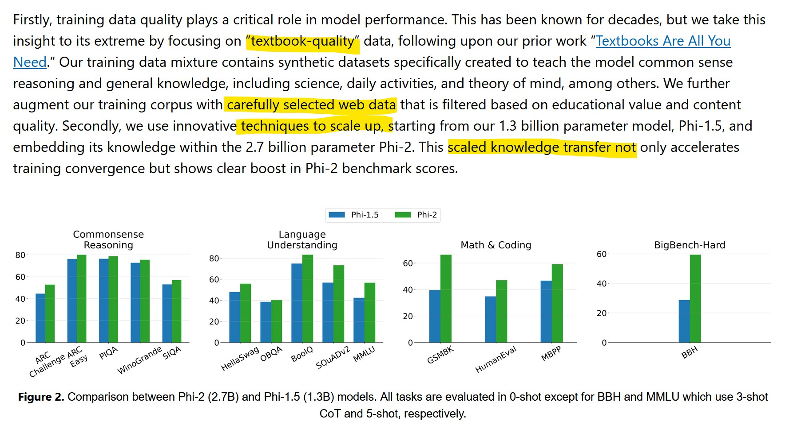

