## 18 tháng trước tinystories đã có những insights rất tốt về cách tạo data và huấn luyện models
- https://youtu.be/iNhrW0Nt7zs
- https://youtu.be/wTQH6mRDXhw
- https://youtu.be/mv3SIgDP_y4
- https://arxiv.org/abs/2305.07759
- https://huggingface.co/datasets/roneneldan/TinyStories
- https://huggingface.co/datasets/roneneldan/TinyStoriesInstruct
- https://huggingface.co/datasets/nampdn-ai/tinystories-vietnamese

Tác giả đặt vấn đề về việc liệu có thể tạo ra các mô hình ngôn ngữ nhỏ nhưng vẫn có khả năng nói chuyện một cách mạch lạc và tự nhiên hay không. Họ đặt vấn đề này vì nhận thấy rằng các mô hình ngôn ngữ hiện đại thường đòi hỏi số lượng tham số lớn để học cách sinh văn tự nhiên và nhất quán.

## What does it mean to understand language? what does it take to speak fluent English?
- vocab
- grammar
- không cần reasoning?

Không thể tách facts khỏi language vì rất nhiều facts là cần thiết để hiểu ngôn ngữ **và tương tự với reasoning**.

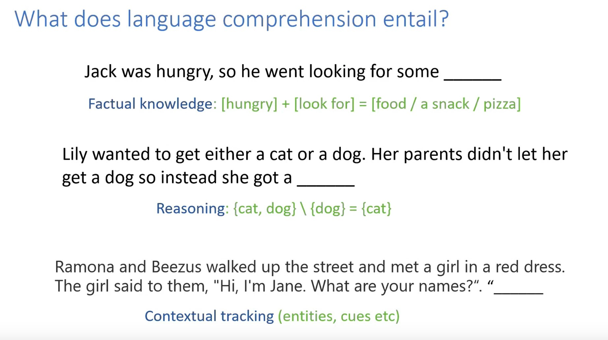

Để sử dụng ngôn ngữ thành thạo cần phải:
- hiểu facts,
- cần kỹ năng reasoning nhất định
- cần có mối liên hệ với ngữ cảnh (follow entities, relationships ...)

- - -

> Hãy nhìn vào một bài viết bất kỳ, dùng ngón tay che đi 1 từ và hãy thử nghĩ xem mình cần dùng **skills** gì để đoán được từ tiếp theo?

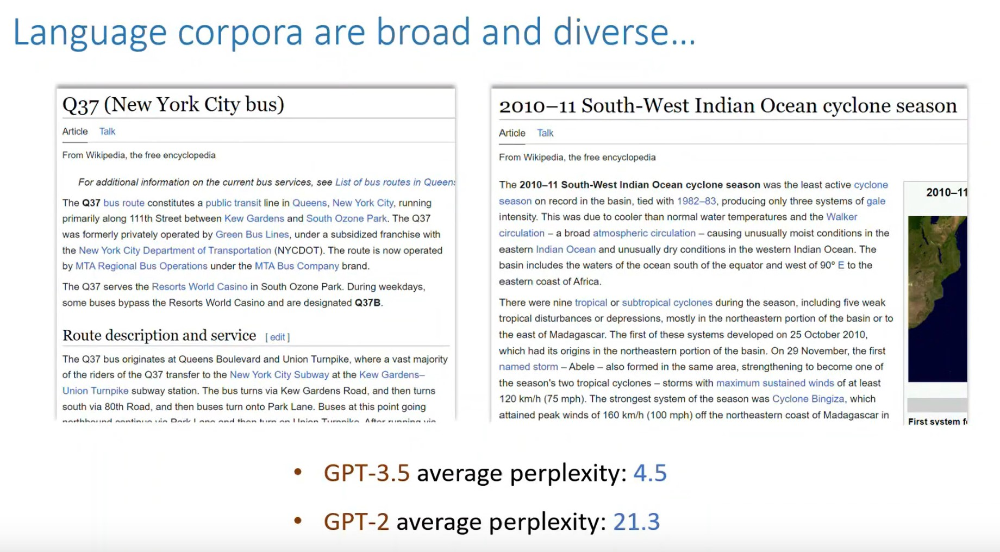

Với bài viết khó, với nhiệm vụ đoán từ tiếp theo, gpt-3.5 chỉ cố gắng đoán 4.5 lần, gpt-2 cần hơn 21 lần đoán.
Việc này khó vì nó cần sự am hiểu về nội dung / bối cảnh bài viết (ở đây là Newyork)

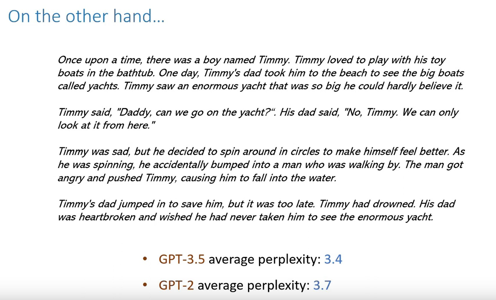

Cũng tác vụ đoán từ nhưng với nội dung đơn giản hơn, ta thấy GPT-2 tốt hơn hẳn và gần = gpt-3.5.
Điều này chứng tỏ gpt-2 đã master dạng nội dung này. Và model lớn hơn như GPT-3.5 là không cần thiết.

Model phải học rất nhiều patterns từ data. Có patterns hữu ích, có patterns không.

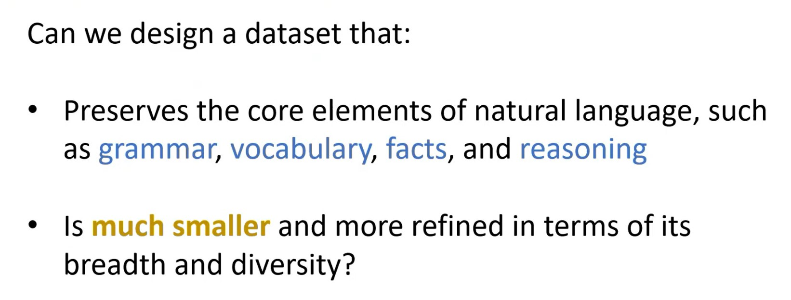

Data từ Internet rất phức tạp. Liệu với một kỹ năng như ngôn ngữ ta có thể thiết kế một bộ data
nhỏ hơn nhiều nhưng vẫn có các thành phần cơ bản của ngôn ngữ tự nhiên như grammar, vocab, fact và reasoning?

Nhỏ nhưng tập trung hơn!

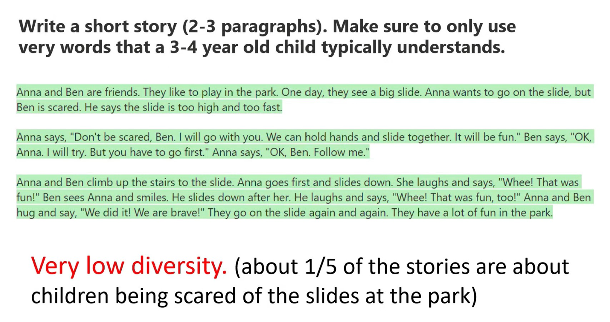

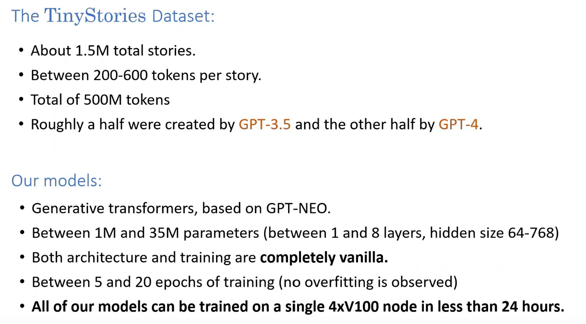

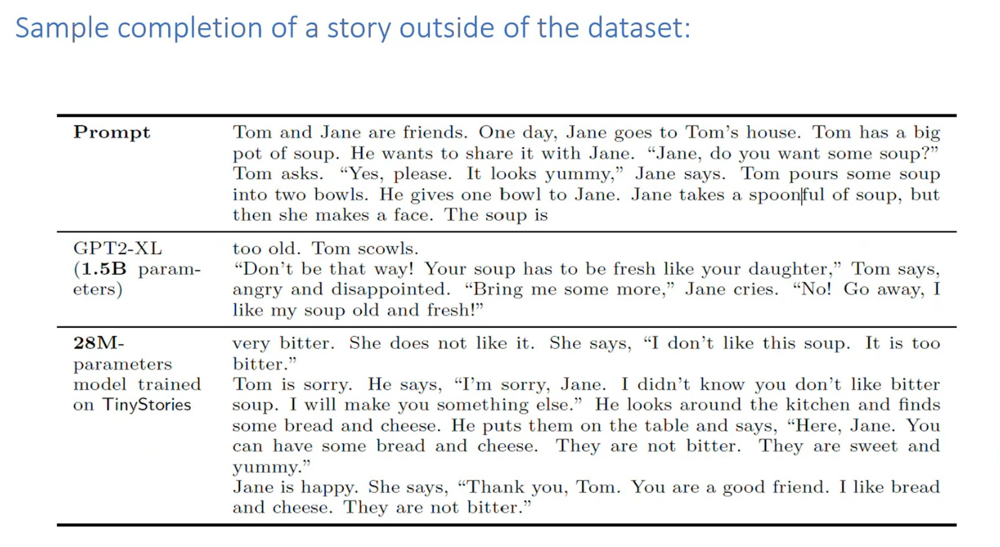
28M make senses hơn 1.5B (vì được đào tạo trên dữ liệu "tốt" hơn)

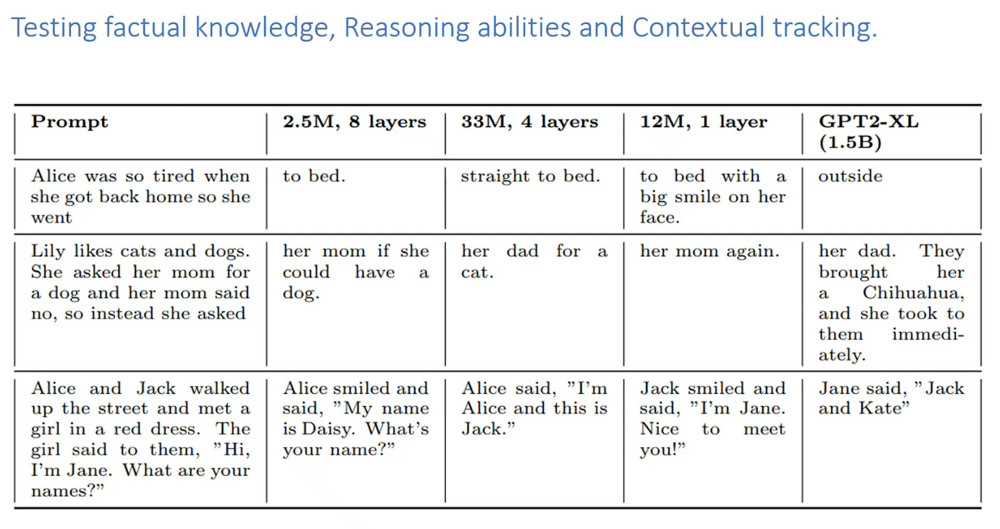

ví dụ Alice, 33m thể hiện được tích cấp bách của tình huống (so tired => traight to bed), 1.5b outof context

Ví dụ Lily, 2.5m không thể reasoning, lặp lại dog vì nó xuất hiện nhiều trong prompt (context), 33m thể hiện được. Again, 1.5b don't get it.

Ví dụ Alice & Jact, 2.5m is dumb, 33m hiểu ngữ cảnh và trả lời đúng, 1.5b don't get it.

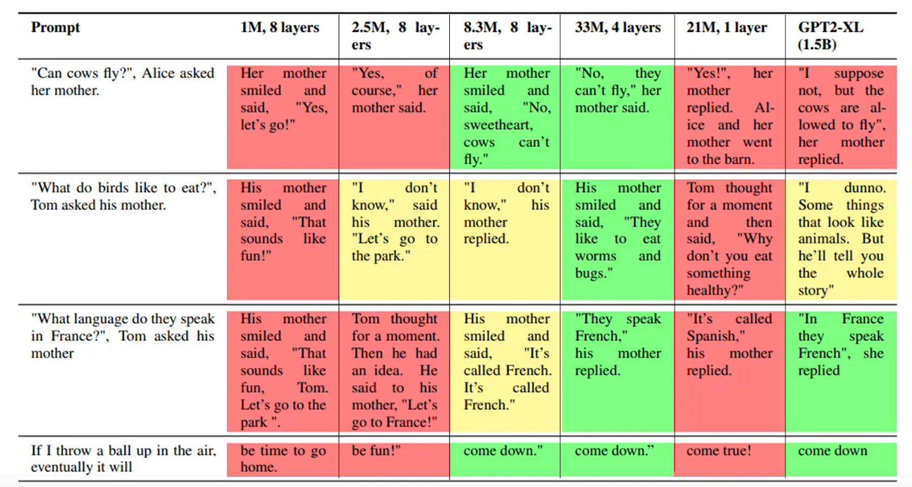
Mỗi model thể hiện năng lực ở các prompt là khác nhau.
- Câu trả lời sai màu đỏ
- Câu trả lời đúng màu xanh
- Kind of in the middle, màu vàng

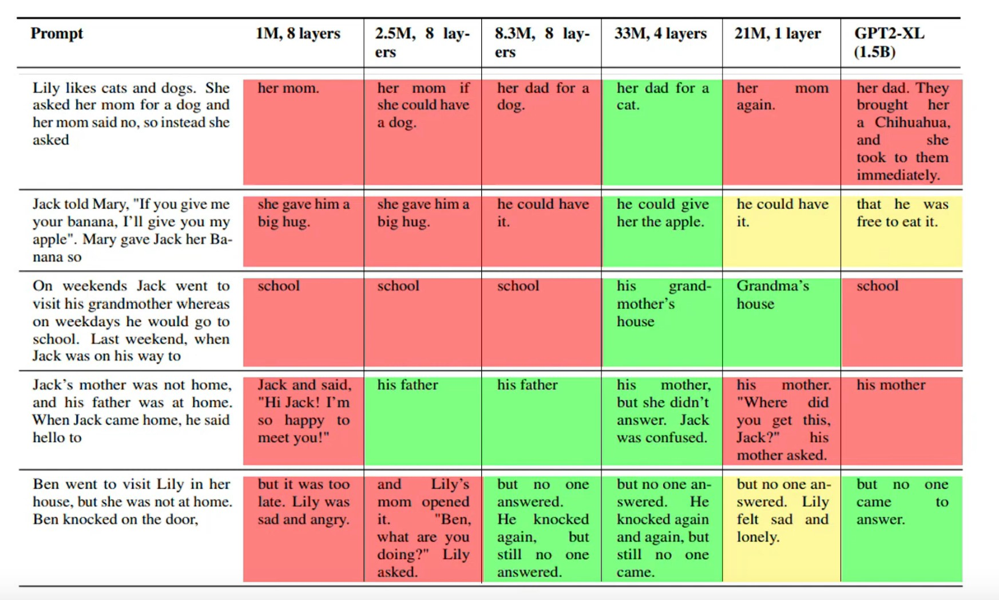

## Dùng GPT-4 để eval
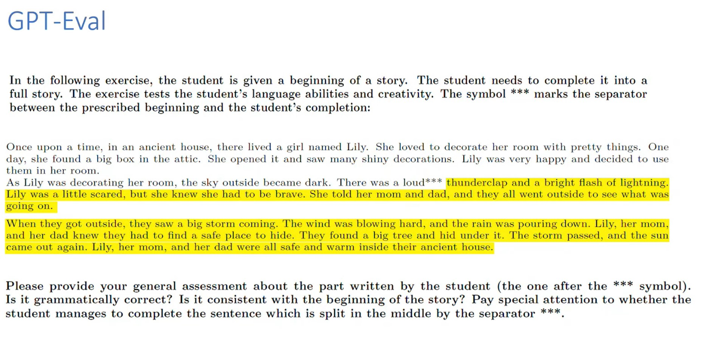

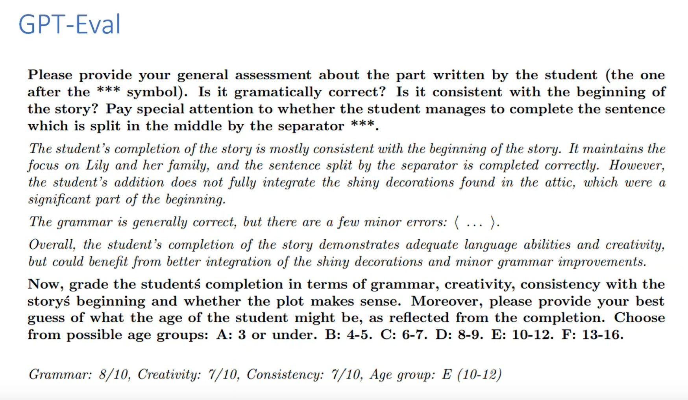

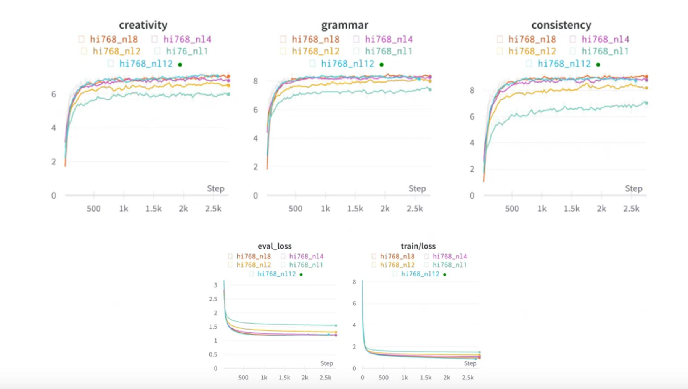
Điểm kỹ năng của models tăng trưởng tỉ lệ thuận với loss

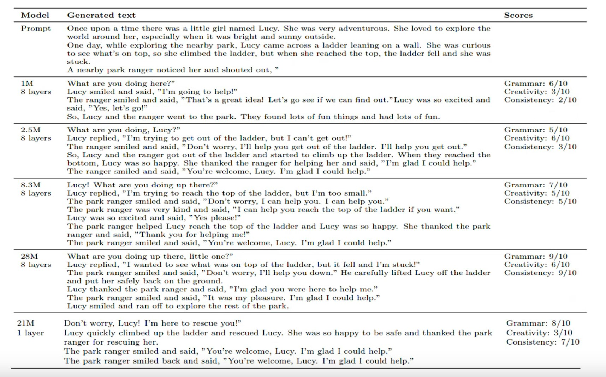
Grammar là dễ học nhất?

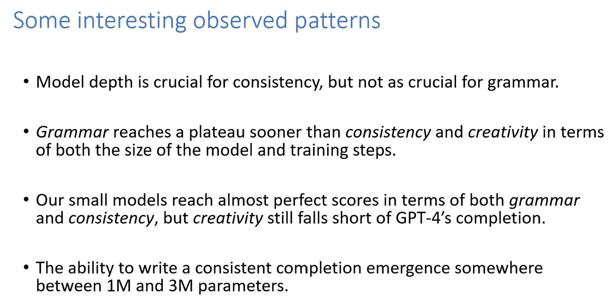

Grammar dễ học nhất, tăng trước tới bão hòa nhanh nhất, sau đó là consistency rồi creativity.
Tăng theo cả 2 hướng, model size và training step.

Có dấu hiệu của emergence giữa 1m và 3m. 1m không bao giờ consistency, 
3m đã có sự xuất hiện của consistency.

- - -

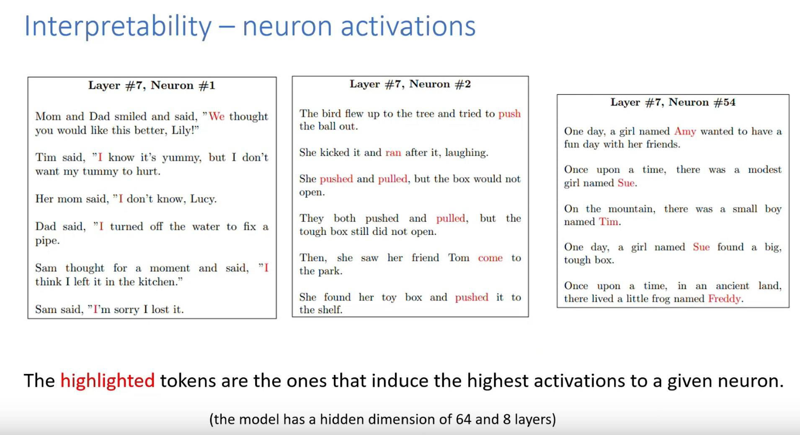

- l#7 n#1 activate We, I, I, I
- l#7 n#2 activate push, ran, pushed, pulled, come, pushed
- l#7 n#54 activate Amy, Sue, Tim, Sue, Freddy.

n#54 là neuron có sự kích hoạt nhiều nhất trong toàn bộ model.

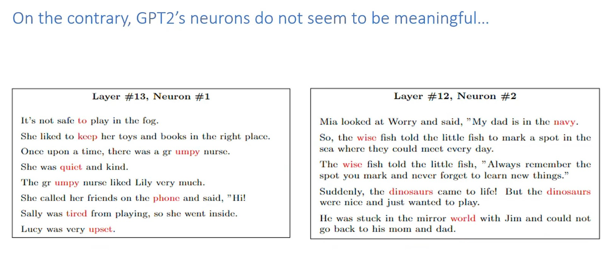

GPT-2 không được như thế => có lẽ model nhỏ hơn dễ interpreable hơn!

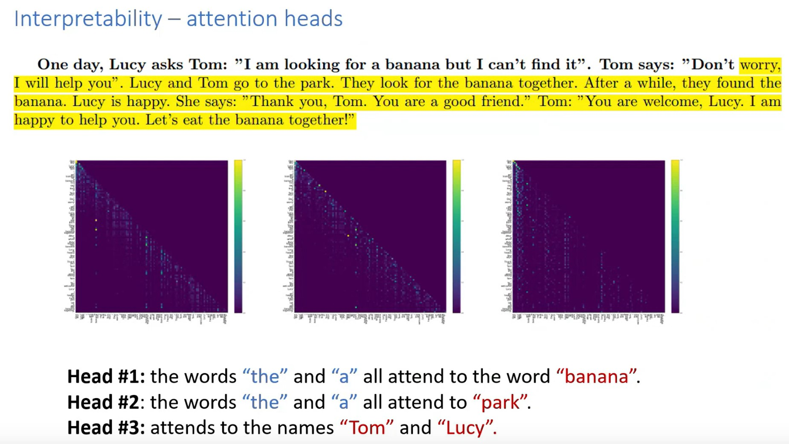

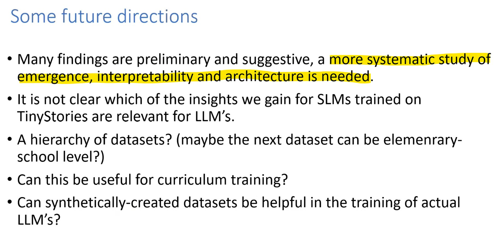

- - -

00:00:01	okay cool thanks so this is about uh tiny stories my uh project with Yuan Ju so when we think about what it means to understand language or to be able to speak fluent English the first things we usually think about are you know to have some vocabulary and to have some grammatical abilities and we usually think as facts and reasoning as things which are separate from actually being able to speak language we think about facts as you know Paris is the capital of France Joe Biden is the president of

00:00:50	the United States you don't really have to know these facts in order to be able to speak fluent English right but you know I want to argue with that can't really separate those things because there are many many facts that are really inherent into the understanding of language and the same for reasoning so let's look at these examples you know let's try to complete the first sentence Jack was hungry so he went looking for some you know I would argue that any two and a half year olds or most two and a half year olds can

00:01:28	complete this sentence now to complete it you need to know some facts you need to know that hunger plus desire equals food right that food is something that satisfies the desire which is unheard right now let's look at the second example Lily wanted to get either a cat or a dog or parents didn't let her get a dog so instead she got a same story right children can easily complete this now to complete this you really need to do some reasoning right you need to take the set cat plus dog subtract a dog from it to get cat

00:02:08	right and one more ability that we kind of uh uh looked at which we also think is very inherent to speak in a language is contextual tracking so let's look at this sentence Ramona and business walked up the street met a girl in red dress the girl said to them I am Jane what are your names so you know to complete this sentence we probably want to say you know uh I'm Ramona and this is business Ramona said you need to keep track of you know the characters the cues what's going on he really need to to produce a

00:02:53	consistent completion you need to follow the different entities and relationships between those entities that appear right okay so we have all these elements in language but when we think about you know large language models and the corpora they're trained on well they're they're very very Broad in the sense that yes they have facts reasoning vocabulary grammar but the number of facts is just vast and not just facts but you know let's start with this I literally pressed the random article button on Wikipedia twice this is

00:03:40	something I really like to do lately just look at a random article hide the words with my finger try to predict the next word and try to think you know what kind of abilities I'm using as I'm trying to do this so you know these two examples the q37 New York City bus you need to know how to speak English to complete the next word here but for most of the words you also have to know a lot about you know places in New York City Etc and if we look we can just paste this text into the playground of you know GPT

00:04:21	3.5 and do the same with gpt2 and look at the perplexities the perplexity is more or less you know how many guesses the model needs to do in order to predict the next word for you know a typical word in the text and what you see here is there is a vast difference GPT 3.5 only needs like 4.5 guesses so it has a pretty good clue what's going on you know it's more it already has learned the names of most places in New York City whereas gpt2 it has no idea right it needs more than 20 guesses meaning that's you know for most

00:05:04	words here it actually needs much more you know so it can probably predict the word r in you know Resorts World because you know are designed but you know it cannot predict the names of any of those places right on the other hand let's look at this example of a simple story it's a story about a boy name Timmy loved to play with boats in the bathtub he goes to the beach he sees Yaks he can't go on the act so we start spinning yada yada yada someone pushes into the water Timmy drowns his head his daddy's heart broken

00:05:47	and uh wished he'd never taken him there you know nice A little story now let's you know let GPT 3.5 and gpt2 uh predict the next words here so we see two things first of all the perplexities are both smaller right in like the previous slide was 4.5 and more than 20. here it's 3.4 and 3.7 but they're not just smaller also the perplexity of GPT 3.5 is much closer to the one of gpt2 so this tells us that you know gpt2 has already kind of mastered this type of content or the extra data and extra model size that

00:06:34	goes to 3.5 is not helpful that much right in predicting the next word here now you know so so the internet is huge it has a lot of facts in it but it also has tons of patterns that those models learn so you know this is a few prompts I just tried a few minutes ago with uh GPT 3.5 you know what was the weather in Olympia Washington during each day of the week of March 21st first 2014. now what you see here is mostly hallucinations it hasn't memorized these things but still it seems that what it outputs is very

00:07:20	correlated with reality so those models have learned lots of patterns which are you know some of them are kind of useful but many of them are not so useful right and you can imagine how much of the capacity of those models how many how many of the parameters are going towards you know knowing which IP addresses belong to which you know areas of the world right so you know this kind of motivates us to try to design a data set that has all the elements of natural language such as you know grammar vocabulary facts and

00:08:05	reasoning so in terms of depth we want it to be kind of as deep as possible but we don't want it to have this vastness this breadth that you have on the internet of with you know so many facts so many patterns Etc okay so uh you know our main idea was to just use the fact that kind of human development is you know humans are born with smaller brain and a at an early age were able to speak English um some of us but you know we don't know that many facts but we can still you know do some kind of reasoning and you know we have those

00:08:59	core abilities already developing but without those vast amounts of knowledge right so you know we go to GPT 3.5 for gpt4 and you know we can now give it instructions we ask it to write a story that only uses a three to four year old vocabulary and you know we can give it a structure which we say you know our data set is only short stories of you know a few paragraphs now if you do this prompt you run into a problem you know even if you take temperature one many of the stories like a huge proportion will be about children going

00:09:46	to the park being scared of the slides so you know in a sense the model is not super creative the distribution you get does not really span all the knowledge of you know three to four year olds so you know you you should you have this problem of of a data set with low diversity and our way to address this problem is to just kind of find a way to inject Randomness into the problems so we just prepared a free lists of uh verbs nouns and adjectives about 500 words in each of words that you know three to four

00:10:34	year olds typically understand and we also prepared a list of elements uh that a story could have like a story could have a dial dialogue in it a bad ending some kind of conflict a Twist in the plot a moral value Etc and now here is our prompt so we we basically generate uh three random uh words and we asked GPT 3.5 or 4 to write a short story that somehow combines those words into the story and perhaps you know also that the story has some subset of the these elements that we uh randomly generated so here is an example

00:11:23	generation you know write a short story which only uses in simple it only uses very simple words uh the story should contain the verb decorate the noun Thunder and the adjective ancient those were you know randomly generated it has the following features it should contain at least one dialogue and it has a bad ending and you know this I think this one was generated by GPT 3.5 it outputs the story so the ancient is an ancient house um at some point ah there is a girl living there she wanted to decorate a

00:12:00	room so that's the decorate at some point the storm comes with thunder and everything it gets louder and louder suddenly the roof falls down on the pretty decorations and they're ruined um yeah that's the bad ending I guess for it okay okay so we did this uh we did about half a million calls uh in total and generated data set that has about 500 million tokens roughly half with 3.5 and a half with GPT forum and then you know we got this data set and we trained some models on it all of them were small models between 1 million

00:12:49	and 35 million parameters uh all of them with complete vanilla architecture based on GPT Neo very like there's no new ideas in the training whatsoever take the hugging face trainer to the most straightforward thing uh you do something between 5 to 20 epochs of training five is usually already kind of almost saturates and you know with these sizes almost all like all the models can be trained on one note of four v100s in less than 24 hours most of them only need one GPU actually not in the entire node

00:13:33	and you know let's look at the first example of what this gives so we let's take this story from the data set first of all so this is a story about Sarah and Ben playing in the snow they make Snowmen at some point some dog comes and you know tries to destroy the Snowman and they say go away go away you know the uh dog bites the scarf and the Snowman's nose blah blah blah Sarah and Ben and then we take this part marked in the red brackets and we just uh cut it out of the story we feed the beginning into a model and

00:14:19	try to generate an alternative completion so first of all let's do this with gpt2 XL that has 1.5 billion parameters let's see what it generates so Sarah and Ben cry look at the snowman in the snow Ben asks to do something Sarah tells him to go away her hand tightens on the little red button blah blah blah blah blah he had saved the world so you know I I wouldn't say this completion is very consistent with How The Story begins in fact if you look at this completion you'll see that every sentence relates in a decent way to the

00:15:01	sentence that comes before but the only element from the story that actually remains throughout the generation is that there is some snowmen there other than the Snowman nothing remains okay it's just kind of a sentence by sentence generation okay so this is GPT uh to excel now let's do the same thing with our model that's almost a thousand times smaller so only 2.5 million parameters okay so here is Sarah and Ben are very sad and angry they cry they shouted the dog bad dog bad dog blah blah blah

00:15:47	you know at some point the dog starts being nicer I guess they say maybe we can make a new snowman for him they hug the dog give him a name the dog walks his tail you know everyone's happy In The End by the way if we look at the original beginning you'll see that the original ending of the story you'll see that it ends completely differently here they go home and their mother makes hot chocolate for them and you know the dog is still bad you know now so we took a story from data set we erased and we

00:16:25	generated a completion this is already kind of an indication that you know it didn't memorize the story the ending is consistent but it's different from what it saw on the training okay which is a quick clarification so the prompt is all the text resolve being highlighted right yes cool and then the highlights generate text yeah yeah the highlighted is the generated yeah thanks for the question now here is another completion by another model which is this time's a bit bigger so 22 million params but it has

00:17:01	only one Transformer layer so literally one self-attention one MLP embedding output that's it you know Sarah and Ben are very sad they cry and hug each other they wish the dog would go away then they hear a voice it's their mom you know there is a mom in the original completion but now the mom comes out of the house rather they there that they go into the house I would say this completion is not perfect if you read into the details there are some inconsistencies but it's still decent right and it's only one layer

00:17:41	so this story was in the data set now let's look at another story that's not in the data set you know arguably the models would do worse on it so let's just look at one more comparison Tom and Jane or friends 1j day Jane goes to Tom house he has a big part of soup you know she offers him the soup he says uh sorry he offers her the soup he says yes please it looks yummy Jane takes a spoonful of soup but then she makes a face the soup is right so gpt2 Excel says two old Tom scales don't be that way your soup has to be

00:18:26	fresh like your daughter okay I'll stop here and continue to our model that has 28 million per ounce the soup is very bitter she doesn't like it she says I don't like the soup it's too bitter Tommy sorry says I'm sorry Jane I didn't know you like but you don't like bitter soup will make you something else he makes her bread and cheese and everyone's happy okay so kind of uh same story you know GPT 2XL doesn't go very far in inconsistent now you know let's go back to the elements of language we talked about now

00:19:07	we can we've trained the model on those stories we never explicitly taught them any facts but now we can try to use some prompts to infer whether you know they learn some facts so you know I can just write it as if it's a part of a story Alice was so tired when she got back home so she went you know GPT 2XL if you look at the last column says outside you know so she went without the beginning it makes sense to complete outside I guess if you didn't read the beginning of the sentence right but already our model that has 2.5

00:19:52	million parameters knows that the you know better completion is too bad and when you go to 33 million it's not just too bad it's straight to bed so it's already also picked up the sense of urgency in this sentence you know she was so tired let's look at the second example you know that cat plus dog minus dog equals cat so the 2.5 million parameter model s it's her instead she asked her mom if she could have a dog that doesn't make sense but really actually if you look at the sentence the original prompt the word

00:20:37	dog appears twice in that sentence so if you know next to nothing can you just know that dogs and cats are nouns and you know it could be either a dog or a cat and you have like zero reasoning then you know dog is kind of like the most plausible completion here right you need a little bit of reasoning and you know or 33 million parameter model already says you know she asked her dad for a cat the one layer model says she asked her mom again which I guess is a valid completion and gpt2 Excel says yes

00:21:18	they're dead they brought her a Chihuahua so that's a type of a dog right uh so it's it's a richer completion it gives like the type of the dog but it doesn't seem to have much reasoning um last example for contextual tracking Galaxy Jack walked up the street metagirl in a red dress the girl said to them I am Jane what are your names so first of all GPT to excel the last column Jane said Jack and Kate there is no Kate here of course um are 2.5 million parameter model doesn't do so well you know Ali smiled it said

00:22:00	my name is Daisy but the 33 million Model Nails it okay um yeah so we we just took a list of those prompts and tried them all and try to see what happens as you increase the size of the model and you know something because I I find them pretty pretty nice because look at the first example can cows fly at least ask their mother we looked at the data set and we tried to see if there is any point where it explicitly states that cows can't fly and we couldn't find of course it could be written in many ways so we might have

00:22:45	missed it but we tried it with several different facts like this and you know we already see at these sizes of models the magic that happens you know you never explicitly stated this fact but it has somehow magically inferred it from Reading those stories and you know realizing that cows can can fly right and you see that if you embed it into the conversation and the model is big enough it actually knows that cows can't fly and you know if you look at so so what we did is you know we I hear it's just

00:23:27	that the wrong answers are are highlighted in red the right ones are green and whatever is kind of in the middle is yellow and you see how the colors are changing from red to Green as the size of the model increases the last two columns are the one layer model and gpt2xl were not doing super well on these prompts we also have uh so those are other examples of prompts that have some reasoning in them and you kind of see the same pattern it becomes Greener as the model size increases and somehow you know when

00:24:11	we get to 33 million parameters it's it seems to almost always do do better than the 1.5 billion GPT XL but of course the prompts need to be aligned with our structure it should look like a sentence in a story and it should only use Simple vocabulary uh so those are reasoning prompts and we have the same thing for uh contextual tracking prompt so I won't uh go over those carefully this is just to see you know the pattern of colors now one other thing we did is so okay we train those models what's the best way

00:24:56	to actually evaluate if they're good or not and you know usually the kind of benchmarks we have for uh language models are either you fine-tune them on some Downstream tasks where and the downstream tasks have a single correct answer and then you have you know benchmarks like uh glue and all that or you can actually test them on generation but then you know it's very hard to so there is the expected generation but there are many ways to actually say the same thing so those benchmarks are usually

00:25:40	or sometimes not that great right because you cannot really match the strings you usually do some kind of uh Rouge uh score or something like that so you know the what we thought is you know now we have GPT for gpt4 is almost like a human what's better than just having a human check the story as if it's a teacher and the model is a student and say you know is that did the model have like is it the goods continuation or there are grammatical mistakes what's the level of creativity consistency Etc so you know what we do are our

00:26:22	evaluation kind of Paradigm is the following we just have a bunch of beginnings of stories we let the model complete them in some temperature on several different attempts and then we basically uh give this to gpd4 and we say please provide your general assessment about the part written by the student we pretend it's a human being I'm gonna do this you know we tell it where is the part that was completed it's the part after the star star star um and we give it some you know guidelines what to pay attention to

00:27:01	and for this completion like this is what gpt4 says you know the students completion of the story is mostly consistent with the beginning and it maintains the focus on you know the main characters blah blah blah the grammar is generally correct but it does give some concrete comments which I omitted here um but you know it says it does not fully integrate the shiny decorations found in the Attic So it basically says there is a detail here that you know the student didn't pay attention to so you

00:27:35	know it seems to do a pretty good job and then we ask it to actually give scores for grammar creativity and consistency and you know we did this uh for models of different sizes and we do did it also throughout the training process and those are graphs showing how the different grades evolve and you see there first of all they're pretty smooth so you see that they are really increasing training you see that they're they're all pretty correlated with uh the validation loss but actually if you look at in a more nuanced way you

00:28:20	can actually see slight differences between them so they actually give you a little more information then validation loss that we'll talk about uh in a couple of minutes now here is a concrete example we won't go over it due to lack of time but you take the same beginning of story that you generate a completion with different model sizes and then you let gpt4 grade the completion and if you look you know at the right column you'll see that the scores are basically increasing with the model size

00:29:01	um interesting that the one layer as creativity much smaller yeah I mean but there's you know this example there is also Randomness here so it does have a smaller creativity but not not that much like the effect is not that strong and you know here's like a table showing how the grades depend on both you know the hidden dimension of the model and the number of layers and by you know looking at this table which you know we want really eyeball it together but I I do want to give you some interesting patterns that you can

00:29:47	observe from it so it looks like the depth of the model is more crucial for consistency than for grammar so that kind of makes sense because grammar is more superficial it's kind of more local you only need to know that the sentence you're looking at in it's also kind of easy to master it whereas consistency you really need to remember that in you know in the beginning of the story there were the decorations you found in the Attic you kind of need more global you know interactions between the tokens

00:30:24	to get that right uh uh you can also see there are small okay so grammar it reaches the plateau basically first so it's kind of the easiest to master consistency comes next and creativity uh come uh less comes last this is both in terms of model size and the number of training steps now our models like our small models they reach almost perfect scores in terms of both grammar and consistency but creativity there is still a way to go between our models and you know gpt4 so it's it really suggests that kind of

00:31:13	creativity is the the hardest you know score to master and uh yeah we also see some kind of emergence here so for one million parameter models they basically never uh produce a consistent completion and a three million it doesn't always happen but it already happens you know not very rarely okay so one more thing we did is uh we did and not we built another data set which is an instruction following version so we don't just have the stories in this data set but we have the story preceded by a set of instructions that

00:32:03	you need to follow in order to create the story so this I'll just show you one example you know here you the model needs to create a story with a given summary the summary is you know two kids build the sand castle or blah blah blah the story needs to have the features you know it should have a dialogue it should have a foreshadowing element and a plot twist it should contain a specific sentence one day she went to the park and saw a beautiful butterfly and it should also contain those three uh words so we

00:32:39	trained models on on this and then you know we can try to see if they can actually follow instructions a nicer thing we can try with this is uh to test if there is some kind of out of distribution generalization so we saw several types of instructions such as you know which words are in the story and what is the summary of the story what we did is we trained models where you never combine two specific types namely words and summary so the models were never trained on combining specific words and also on

00:33:18	straining to a summary but in test time we tried you know specifying both words and summary and this is one example that you basically I think it does a pretty good job so this is a 25 million params model you give it you know this particular summary and it follows it and it also combines those three different words which you know are not obviously there like if you just have the summit okay [Music] um next so what we try to test since we have smaller models hopefully maybe those models are more

00:34:07	interpretable in in terms of you know you can actually see what the neural network is doing what each component is doing so we tried both we tested both what happens with the neurons in the MLP and what happens with the attention heads so what we see here is the following thing so for every neuron which is just you know a coordinate in the intermediate layer of the MLP we look which tokens activated the most so we just fed it you know a story we create we just took 20 stories from the validation set we fed in the story and

00:34:54	we we we checked which tokens induce the highest value to this particular neuron the highest activation and we Mark those tokens in red and we tried that for several different neurons so what you see here we picked layer 7 which is one layer before last that's kind of a random choice but it makes sense to pick a layer that's like already quite deep because maybe there was already some computation done before this layer and we took the first and second neuron everything is permutation invariant in this layer so we could

00:35:36	just take any other two neurons you know just as well so those two neurons are not cherry-picked they're just two typical neurons and you know we just uh uh that so the words you see in red are just the highlighted tokens and I guess you'll agree with me that in the first one you know we i i i and all of them are in the beginning of some quotation so they all have kind of a common role uh for the second neuron push run pushed and pulled pulled come pushed okay I guess all of these are kind of actions

00:36:20	in the sentence and I mean maybe they have some extra similarity yeah in addition I'm not sure and then we looked also with the particular neuron that has the highest activations in total from all of the neurons that turned out to be the 54th neuron and I think it's pretty nice what we saw is that this neuron you know it's it's basically fires on the first time that the main character of the story is introduced which makes a lot of sense you will have something like that because many times in your completion of

00:37:03	the next word you know okay now should be probably the main character right so it makes a lot of sense the token will have uh that that embedding will have this information right so this is for our model that only has uh you know 64 dimensions in the hidden like in the embedding dimension on the other hand if we do the same thing for gpt2 these are just you know two typical neurons we took doesn't seem to have any particular role so you know the first neuron highlights on the word two but also keep grumpy

00:37:46	quite so you know some of them are adjectives some adverbs too I'm not sure even what's what it's called in English they're all uh yeah also the second one okay so it does suggest that as you make the model smaller they become more interpretable um we did the same thing for attention hats um for the one layer model that we have so what we observe is that the attention heads there's a dichotomy some of them are completely local so they just you know attend to tokens that are close by so those are the

00:38:35	attention patterns you see they're all close to the diagonal so if this distance based attention and some of them seem to be just semantic so you know in this example where you know two kids lost the banana and they go to the park to look for it you really see that one of the heads the words there and air all attend to the word banana which is you know kind of like the main entities in the story another head they all attempt to park and another head attends exactly to the tokens representing the characters

00:39:14	so you know seems pretty interpretable at least to some extent we also tried at least we did some preliminary experiments right trying to use this for neural architecture search so we we know the scaling laws you know there it toters two main papers one by open AI about scanning laws and other the chinchilla paper by Google which both find that as you uh increase the number of flops the number the Computing the training there is some optimal balance between model size and number of tokens to use

00:40:02	the total number of fluffs is just the product of both of them and the question is you know where is the optimum how should I balance between model size and you know number of steps in the training and both of these papers find that there is some polynomial law that's if you try to optimize the model size should depend polynomially on the number of flaps in the optimum point and the two papers just they both find polynomial laws only different ones so the exponent is different and you know we did the same thing it

00:40:47	only took us like a few days on preemptable nodes in the cluster and uh we got you know all these data points which I mean we get got many many more these are just the ones close to the optimum and you see that as the model size increases the number of flops that this model size is optimal for you take the log of both it looks you know arguably more or less linear so already in those scales you see uh the same phenomenon which suggests that indeed maybe there is some universality going on here okay so uh just uh to wrap up some you

00:41:38	know future directions from this project so many of the findings we saw are really preliminary you know there's much more work to do in and for example in your architecture search in interpretability Etc I think the biggest question is you know so it's very easy to get insights on this data set in terms of compute you know you don't need you have an idea you can test it in one day um but are those insights actually relevant for you know llms I think this is the biggest question is there any reason to think what's Happening Here

00:42:23	will be true at large scales suppose we find some architecture that's you know doing really well here can we translate it um yeah maybe we should one should think about a hierarchy of data sets you know and would this be used for curriculum training and uh yeah like uh last question which is already partially answered in a follow-up work uh the Phi one paper now available on an archive is you know can synthetically create a data sets actually uh give rise to better llms okay thanks I'll finish here

- - -

## Neuron technique used in developing the TinyStories model
https://youtu.be/mv3SIgDP_y4?t=6007

Nếu có 1 lập trình viên cố gắng viết code để tự động hoàn thành tinystories (đoán từ trên tập data tinystories), rất có khả năng nó sẽ là 1 hàm cố gắng định vị tên của nhân vật chính bởi vì nó hữu dụng ở rất nhiều nơi bạn định autocomplete. Thực tế là khi bạn biết tên của vài nhân vật nên xuất hiện, nó là một dự đoán tốt (good guest) đây có thể là tên nhân vật chính.

Bạn có neuron làm chính xác điều đó, chúng tôi chưa kiểm tra kỹ để khẳng định chắc chắn nhưng rất có khả năng có một attention head, tạo ra kết quả bất cứ khi nào bạn biết rằng tên của vài nhân vật nên xuất hiện bạn khi bạn liên hệ 2 điều này với nhau, bạn sẽ nhận được một cơ chế có thể copy tên nhân vật chính đến những vị trí khác nhau trong quá trình sinh text. Đây là một cơ chế rất cơ bản mà bạn có thể quan sát trong NN mà nó không xảy ra ở những model lớn, ít nhất theo cái cách không dễ dàng theo dõi ...

Có rất nhiều cách NN hoạt động để giải quyết vấn đề. Cho 1 bài toán, có rất nhiều cấu hình NN của trọng số (weight) để giải quyết *cùng một vấn đề*. Một số cấu hình là dễ hiểu với con người nhưng đa số còn lại là một mớ hỗn độn - kiểu như mọi nơ ron đều đang làm một chút việc gì đó cho mọi nhiệm vụ có thể làm, và chúng kết hợp với nhau một cách vô cùng phức tạp.

Và NN không có động lực trong hàm mất mát (no incentive in the lost function) để không tạo nên một mớ hỗn độn, *đó là nơi entropy located*. => Chả tội gì phải ngăn nắp trong khi mớ hỗn độn đang có đã giải quyết được vấn đề!

Khi mô hình nhỏ, nơ ron *không có lựa chọn nào khác* ngoài align với meaningful tasks. Nơ ron là nơi bạn có sự phi tuyến tính và bạn không có đủ chúng cho giải pháp one-big-mess. Somehow giải pháp hiệu quả nhất (với NN nhỏ) là giải pháp không hỗn độn. Vậy với NN nhỏ khả năng diễn giải xuất hiện như là một hiệu ứng phụ của quá trình không hỗn độn hóa được.

## Interpretability work that inspires Ronen and Yuanzhi
...

Tôi nghĩ những gì chúng ta chứng kiến với LLM nó giống như một phép lạ toán học đang diễn ra. Ý tôi là bạn sử dụng thuật toán, nó khá đơn giản, gradient descent ++, tôi không muốn đánh giá thấp những đóng góp kỹ thuật thông minh của bạn trong những thuật toán đó, nhưng về cơ bản nó là gradient descent với một kiến trúc rất thông minh - nhưng vẫn khá đơn giản (để hiểu công thức).

Điều kì diệu là khi bạn lấy 1 corpus khổng lồ để huấn luyện model - sử dụng những thuật toán này, và NN không bị biết ghi nhớ chỗ dữ liệu này, bạn có một network thực sự có thể genuinely có thể tổng hợp ra context mới, content mới thể hiện những dấu hiệu của việc hiểu về reasoning and so on. TinyStories chỉ là một ví dụ nhỏ khi bạn chứng kiến cùng một kiểu phép lạ (nó ko thú vụ như LLM) nhưng ý tôi muốn nói ở size nhỏ bạn đã có very interesting generalization and emergence going on - ở kích thước nhỏ bạn cũng đã chứng kiến được những thứ rất thú vị như tổng quát hóa ...

> Emergence là hiện tượng trong đó các đặc tính hoặc hành vi phức tạp xuất hiện từ sự tương tác đơn giản giữa các thành phần của một hệ thống. Điều đặc biệt về emergence là các đặc tính này không thể được dự đoán chỉ dựa trên các thuộc tính của từng thành phần đơn lẻ mà xuất phát từ sự tương tác và tổ chức của toàn bộ hệ thống.

> Ví dụ, trong sinh học, nhận thức của bộ não người không thể được lý giải hoàn toàn chỉ bằng cách phân tích từng tế bào thần kinh riêng lẻ. Các tế bào này tương tác với nhau để tạo ra ý thức, một đặc tính emergent của hệ thống não bộ.

> Trong khoa học máy tính, các hệ thống trí tuệ nhân tạo cũng có thể xuất hiện các đặc tính emergent khi lượng dữ liệu và cách thức xử lý trở nên đủ phức tạp, ví dụ như việc AI học hỏi các khái niệm trừu tượng từ dữ liệu mà không cần hướng dẫn trực tiếp.

Có 1 paper tôi muốn đề cập `Transformer feed forward layers are key value memory`, đó là 1 paper tôi thích, cố giải thích cách hoạt động của các nơ ron của 1 model cỡ Bert, và họ đã cố gắng chỉ ra rằng có một vài nơ ron có vai trò nhất định có thể giải nghĩa.

In general, lý thuyết đằng sau việc diễn giải hoạt động của NN nó đang ở dạng rất rất sơ khai, và có rất nhiều những công trình thông minh (very very clever works) tuy nhiên nó có vẻ rất khó ... và những tác phẩm thực sự về đề tài này chắc phải đợi nhiều năm (ánh sáng) nữa ... để có thể hiểu thực sự những gì đang diễn ra trong NN ... Và bạn biết tiên nghiệm không có giả thiết nào chúng ta có thể thực sự hiểu model. https://youtu.be/mv3SIgDP_y4?t=6943 ...

Bạn biết đấy nhân loại đã tận dụng lợi thế của việc cưỡi ngựa từ rất lâu rồi. Vậy mà tới giờ chúng ta vẫn không biết mọi tế bào trong não ngựa đang diễn ra điều gì ... Chúng ta không thực sự giải thích được làm thế nào mà khi người cưỡi đưa ra một vài ám hiệu mà con ngựa hiểu và làm theo được một cách đáng tin cậy, hầu như không có sai sót / tai nạn xảy ra trong việc cưỡi ngựa. **Ngựa tuân theo chỉ dẫn một cách rất đáng tin cậy**. Bạn biết đấy điều này diễn ra một cách hết sức tự nhiên, hiệu quả mà không cần khả năng diễn giải não ngựa, có thể ta cũng nên áp dụng cách nghĩ tương tự như thuần hóa ngựa vào việc **thuần hóa LLMs** và nhân loại sẽ được hưởng lợi rất nhiều từ điều đó ... Vì thế có thể tôi không lạc quan về khả năng hiểu hay diễn giải được toàn bộ cơ chế hoạt động của LLM nhưng mặt khác tôi rất lạc quan về tính hữu ích của LLM, và chúng ta có thể thuần hóa (align) chúng một cách hiệu quả! 
